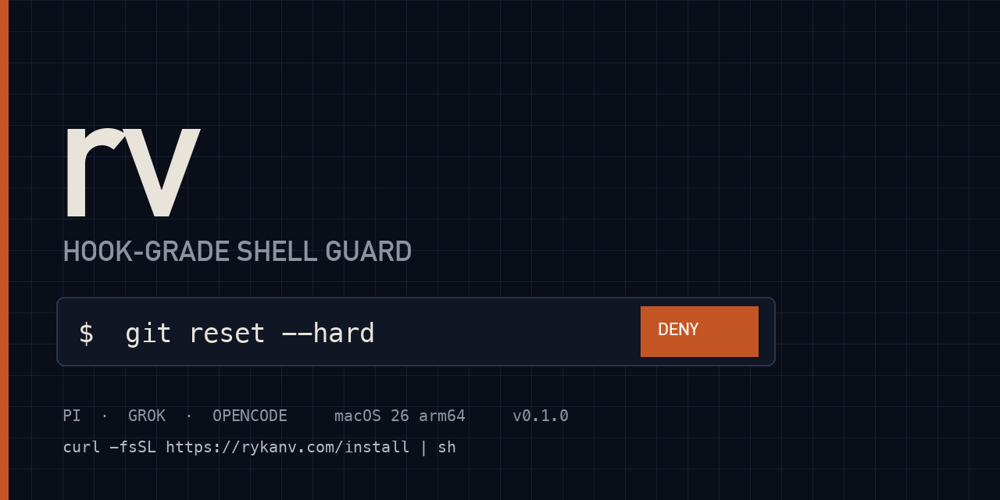

<p align="center">
  <picture>
    <source media="(prefers-color-scheme: dark)" srcset="docs/assets/rv-banner-dark.png">
    
  </picture>
</p>

<p align="center">
  <a href="https://github.com/christopherkarani/rv/releases/latest"></a>
  <a href="LICENSE"></a>
  <a href="https://github.com/christopherkarani/rv"></a>
  <a href="https://discord.gg/uZn9MDUYKx"></a>
  
  
</p>


# rv (Rykan V)

**Control what your agent can do, rv blocks dangerous commands before they can run**

Site: [rykanv.com](https://rykanv.com) · Docs: [rykanv.com/docs/introduction](https://rykanv.com/docs/introduction) · Discord: [discord.gg/uZn9MDUYKx](https://discord.gg/uZn9MDUYKx)

## Why this exists

Everyday I find a new victim of rm -rf, when agents are deep in work, they can make mistakes. Irreversible mistakes, like sending a badly formatted email to your hottest sales lead or deletes your production db, rv acts as the control layer you enforce on your agents to block them from doing this. setup is simple, run the curl command and the script and rv will place itself before the hook runs.

## Quick start

```sh
curl -fsSL https://rykanv.com/install | sh
```

## What it does

| | |
| --- | --- |
| Destructive git | `reset --hard`, `checkout --`, `clean -fd`, `push --force`, `stash clear` |
| Destructive fs | `rm -rf`, `find -delete`, and similar |
| Secret paths | `.env`, SSH keys, and other known credential files |
| Allow once | `rv allow-once` unlocks the next matching call in this working directory |
| Explain | `rv explain` shows which pack would fire |
| Hosts | Pi, Grok, OpenCode — wired by `rv setup` |
| Platform | macOS 26, Apple Silicon |

## Supported hosts

| Host | After `rv setup` |
| --- | --- |
| Grok | `~/.grok/hooks/rv.json` |
| Pi | `~/.pi/agent/extensions/rv-guard.ts` |
| OpenCode | `~/.config/opencode/plugins/rv-guard.js` |


## Commands

```sh
rv setup                         # wire hosts
rv scn                           # scan repo for destructive actions in the past
rv test 'git reset --hard'       # evaluate, do not run
rv explain 'git reset --hard'    # which pack would fire
rv allow-once 'git reset --hard' # next matching call in this cwd
rv packs                         # catalog
rv packs enable <pack>           # Enable a pack
rv doctor                        # health
rv uninstall                     # raw dog it
```

## License

Apache 2.0. See [LICENSE](LICENSE).
