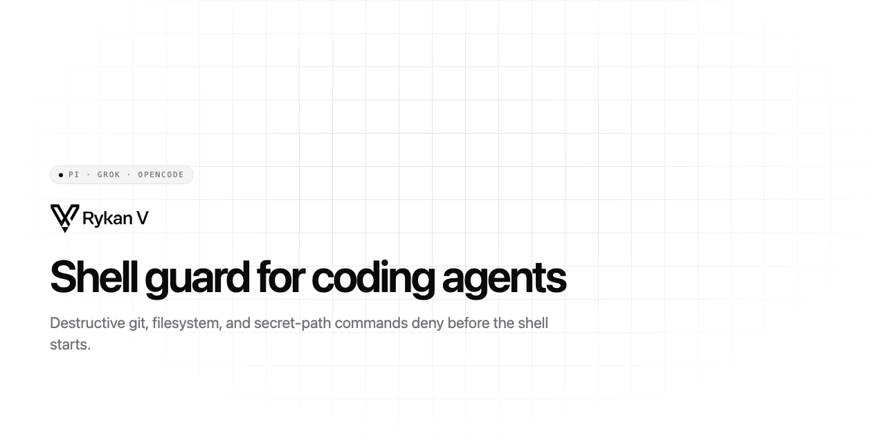

<p align="center">
  <picture>
    <source media="(prefers-color-scheme: dark)" srcset="Resources/rv-banner-dark.png">
    
  </picture>
</p>

<p align="center">
  <a href="https://github.com/christopherkarani/rv/releases/latest"></a>
  <a href="LICENSE"></a>
  <a href="https://github.com/christopherkarani/rv"></a>
  <a href="https://discord.gg/uZn9MDUYKx"></a>
  
  
</p>


# rv (Rykan V)

**Control what your agent can do.** rv's **hook-grade** guard blocks destructive shell (and Read / Edit / Write secret-path on Grok, Claude, and Cursor) when the host calls `rv`. Hook evaluation requires the host to invoke it.

`rv opencode` launches OpenCode under a macOS Seatbelt that starts from deny-default. The process may read and write the workspace, and it may read the system locations needed to execute programs. Network is denied. It can signal processes inside its sandbox, not other host processes. A workspace that already contains a hard link is refused; a link created after that scan is not. A background child can keep writing in the workspace after its parent returns. Mach service lookup is not filtered. Linux refuses the launch instead of applying a weaker sandbox. This is not a finished agent isolation boundary. See the [release acceptance audit](docs/security/runtime-acceptance.md).

Site: [rykanv.com](https://rykanv.com) · Docs: [rykanv.com/docs/introduction](https://rykanv.com/docs/introduction) · Discord: [discord.gg/uZn9MDUYKx](https://discord.gg/uZn9MDUYKx)

## Why this exists

Agents delete the wrong tree. rv sits on the host's pre-tool hook and denies the command before the host runs it. Install is one curl; `rv setup` writes adapters for hosts it can see.

## Quick start

```sh
curl -fsSL https://rykanv.com/install | sh
```

To launch the currently supported agent from a writable workspace:

```sh
rv opencode --workspace /absolute/repo -- run 'describe this project'
```

RV searches absolute `PATH` directories for OpenCode, or accepts `--executable /absolute/opencode`. The child receives a minimal environment with `HOME` and `TMPDIR` set to the workspace and `PATH=/usr/bin:/bin`; credentials and custom runtime paths are not forwarded. On macOS the process and its children may read and write only that workspace, plus the system locations needed to execute `/usr` and `/bin` programs. Network connections are denied. Signals to processes outside the sandbox are denied. A workspace that already contains a hard link to another file is refused. Linux refuses this launch until its backend enforces the same limits; a write-only sandbox is not used instead. Other host integrations remain hook based.

## What it does

| | |
| --- | --- |
| Destructive git | `reset --hard`, `checkout --`, `clean -fd`, `push --force`, `stash clear` |
| Destructive fs | `rm -rf`, `find -delete`, and similar |
| Secret paths | `.env`, SSH keys, and other known credential files |
| Allow once | Redeem the code from a block; the next matching call in this working directory runs once |
| Explain | `rv explain` shows which pack would fire |
| Hosts | Grok, Pi, OpenCode, Claude, OpenClaw, Hermes, Codex, Cursor. `rv setup` writes a host only when that host is already on the machine. |
| Platform | macOS 26 Apple Silicon, Linux aarch64/x86_64. PR CI Linux is ubuntu-24.04 x86_64; aarch64 is a supported install, not a PR job. |

## Supported hosts

| Host | After `rv setup` (if detected) | File-tool Read / Edit / Write |
| --- | --- | --- |
| Grok | `~/.grok/hooks/rv.json` | yes |
| Pi | `~/.pi/agent/extensions/rv-guard.ts` | shell only |
| OpenCode | `~/.config/opencode/plugins/rv-guard.js` | shell only |
| Claude | settings merge | yes |
| OpenClaw | `~/.openclaw/extensions/rv-guard/` | shell only |
| Hermes | `~/.hermes/plugins/rv-guard/` | shell only |
| Codex | `~/.codex/hooks/rv-guard.py` | shell only |
| Cursor | `~/.cursor/hooks/rv-guard.py` | yes |


## Commands

```sh
rv setup                         # wire hosts
rv test 'git reset --hard'       # evaluate, do not run
rv explain 'git reset --hard'    # which pack would fire
rv scan                          # session forensics (deny-only findings)
rv allow-once a1b2c3             # redeem the code from a hook deny
rv packs                         # catalog
rv packs enable <pack>           # enable an extra pack (day-one always compiled)
rv policy show                   # typed rules
rv allowlist list                # permanent exceptions
rv doctor                        # health
rv uninstall                     # remove rv-owned files
```

Anonymous usage is on by default. Turn it off with `"analytics.enabled": false` in `~/.config/rv/config.json`. Setup does not print a notice.

## License

Apache 2.0. See [LICENSE](LICENSE).
