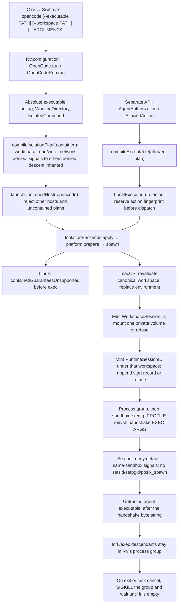

# RV runtime security boundary

Last updated: 2026-09-22. Audit base: `854e69103333a65e86deacac853f915adc450868`, with the uncommitted hardening pass described in [the acceptance matrix](runtime-acceptance.md). **Release status: NOT SATISFIED.** The implemented macOS containment is a deny-default Seatbelt scoped to the workspace, with the system paths required to start programs left readable. It is not a complete agent capability system.

## Implemented execution paths

Contained macOS launch mints a `WorkspaceSessionID` for the protected workspace and a `RuntimeSessionID` for each contained process. Neither is the hook `SessionID`, and neither launch API accepts a caller-chosen value. The workspace id is the parent of every runtime started inside it. `rv opencode` opens one workspace, runs one runtime, and closes the workspace when that process returns. A workspace can host more than one runtime; each has its own process group and admission capability, and they share the one private volume. Closing the workspace is what publishes. One runtime exiting does not. `rv <agent>` currently means the single registered `rv opencode` subcommand. Other agent hosts are not launchable through this door. The selected executable need not be a verified OpenCode binary; `--executable /bin/sh` is deliberately supported for testing. `HookHost.opencode` identifies the launch adapter, not a principal.

`LocalExecutor.perform` is an independent authorized-action API. It is not called for the OpenCode process or its tools. Agent-created descendants do not re-enter `perform`, policy evaluation or approval. Their inherited kernel restrictions are the only RV containment applied to those operations. Hook evaluation/history elsewhere in RV does not establish mediation of this process tree.

The general `IsolationBackends.apply` API still implements explicit observed/mediated execution without a sandbox. `launchContainedHost` and `LocalExecutor.run` reject these modes, and the CLI constructs contained plans. This is a restricted launch door, not proof that every use of RV's library APIs is supervised.

## Components and trust assumptions

| Component | Trust and concrete responsibility |
|---|---|
| RV CLI, `OpenCodeRun`, domain compiler, isolation backend and executor | Trusted code. Validate launch input and request the fence. They have the invoking user's ambient authority. |
| macOS kernel and `/usr/bin/sandbox-exec` | Trusted enforcement/loader path. The kernel enforces the generated write rules on the process and descendants. |
| Linux kernel, helper, dynamic loader and linked libraries | Trusted pre-isolation path. Helper must be an executable regular file named `rv-isolation-exec` outside the workspace. This is a path check, not cryptographic authentication, ownership validation or an inode-pinned launch. |
| Workspace and agent executable/arguments | Untrusted work. The host/operator deliberately selects the write root and executable. Agent-written scripts, replacements, shebangs and descendants are untrusted. |
| Parent directory tree and installed RV/helper | Assumed stable and outside adversary write authority while preparing and launching. The audit has not established protection against a same-user external attacker replacing these resources. |
| Standard handles | macOS contained spawn grants only stdio plus the handshake write end. `launchContainedHost` inherits the parent's stdin, stdout, and stderr. `LocalExecutor` and the default `apply` path point all three at `/dev/null`. The wrapper closes fd 3 before exec. Inherited stdio is still a capability to whatever resource it already references. Observed and mediated execution is unsandboxed and is not this boundary. |
| Host services, Unix sockets, system processes and credentials | Not isolated by the current capability model. OS permissions still apply; RV does not add default-deny access rules for them. |
| Hook request `SessionID` | Optional validated nonempty self-declared string, not an authenticated runtime identity. It must not become a credential/wallet authority without a new binding. |

The C frontend now locates its sibling `rv-cli` from the running executable path (`_NSGetExecutablePath` on Darwin, `/proc/self/exe` on Linux), not caller-controlled argv0 or HOME. Linux Swift helper resolution uses only the `/proc/self/exe` sibling; it has no argv0/bundle fallback on Linux. Legacy lookup is confined to the non-Linux conditional branch. Darwin/Linux C tests and the staged PATH CLI proof validate the corrected dispatch. These checks do not authenticate file ownership/content or eliminate executable replacement races.

Seatbelt still authorizes the path used in the syscall. On the tested Mac, a hard link inside the workspace to an outside inode let a sandboxed write change that outside file. RV now refuses a regular file whose link count is already above one, then mounts the workspace path on a fresh volume before any runtime starts. That volume belongs to the workspace. A second runtime does not mount again. A hard link from another device fails with `EXDEV`, including a link created by another same-user process after preflight. Copy-back runs once, when the workspace closes, and writes a saved inode only when its device, inode, and kind still match the pre-launch snapshot. Regular files and symlinks must also keep their link count. A directory's link count changes as its children are published, so that count is not directory identity. A runtime exiting does not copy anything back. A same-user `diskutil unmount force` can remove the volume; that case is not closed. Linux contained launch still does not execute.

## RV policy, RV checks and OS enforcement

**RV policy:** `Sources/RVDomain/Isolation.swift` defines closed enums and immutable plans for observed, mediated and contained modes. Contained means `.workspaceScoped(workspace)`, network `.denied`, process `.hostSignalsDenied`, and descent `.inherited`. These are isolation intentions, not authenticated per-agent capabilities. `compileIsolationPlan` is a pure function of its typed input. Backend compilation additionally resolves filesystem paths, so its output depends on the current filesystem. Landlock compilation of that plan fails closed.

**RV launch checks:** `IsolatedCommand` rejects relative/empty executables and embedded NULs in argv. Contained prepare/run checks reject `/`, nonexistent and non-directory workspaces, unsafe paths, and a caller alias retargeted between prepare and spawn. The spawn boundary replaces the environment with `PATH=/usr/bin:/bin`, `LANG=C`, `LC_ALL=C`, `HOME=<workspace>` and `TMPDIR=<workspace>`. Ambient secret values, loader variables, interpreter variables, proxy/socket references and search paths are not forwarded. A shell can add its own bookkeeping variables. This restricts inherited environment authority; it does not hide host files or network services.

**Seatbelt enforcement:** `SeatbeltProfile.swift` generates `(deny default)`. It allows `process-exec`, `process-fork`, `signal` inside the same sandbox, `sysctl-read`, unfiltered `mach-lookup`, `file-read-data` of the root inode, `file-read-metadata` on `/private`, `/tmp`, `/var`, and `/Users`, and file read/map/ioctl on `/usr`, `/bin`, `/System`, `/Library`, `/dev`, plus read/write of the canonical workspace. It denies `setpgid` (syscall 82), `setsid` (147), and `posix_spawn` (244) so a descendant cannot leave the process group RV owns. `fork` and `execve` stay allowed. The granted executable is an extra literal read/map allow, including its realpath. Actual macOS tests deny ordinary outside reads and writes, symlink reads and writes, relative traversal, interpreter and shell wrappers, loopback and public TCP, UDP, IPv6, Unix sockets, and DNS. `kill` of another test-owned process is denied. One deliberate hole: the confstr per-user temp dir is granted read-write because SwiftBuild backend tasks drop TMPDIR/TEMP/TMP and fall back to it (link temp files, test-bundle plist temp dirs); macOS isolates that dir per-user only, and outside-fence probes live under `/tmp` instead. Quotes and backslashes in profile paths are escaped; NUL, newline, and root paths fail validation. A workspace regular file with link count greater than one refuses launch. The profile also denies `file-link` and `file-clone`. The separate volume, not the scan, is what blocks a hard link created after preflight. `mach-lookup` is not a closed IPC policy. Linux does not apply this profile.

**Landlock enforcement:** the C shim handles write-class filesystem bits, including `REFER` and `TRUNCATE`, and requires ABI 3. It sets `no_new_privs`, resolves the canonical workspace with `openat2(RESOLVE_NO_SYMLINKS | RESOLVE_NO_MAGICLINKS)`, then applies `landlock_restrict_self` before `execve`. Helper startup closes descriptors above 2 using `close_range`, failing closed if that fails. No read/execute/network rules, namespaces, seccomp, cgroups or PID controls are installed by RV. Docker's namespaces/seccomp/network restrictions in the audit fixture belong to Docker and are not RV guarantees. Actual Landlock enforcement was **not available** on the tested Linux kernel; only unsupported-kernel fail-closed behavior and separately labeled C setup tests were observed.

The [Linux kernel Landlock API documentation](https://docs.kernel.org/userspace-api/landlock.html) describes inherited restrictions and limitations for descriptors opened before sandboxing. It is platform background, not evidence that RV applied those controls on a supported kernel.

The code does not support a host or domain allowlist. Seatbelt's profile still has no network allow. The only network path is the admission broker's one public HTTPS GET, described below. It is not a general network capability.

## Failure and lifecycle limits

1. Invalid commands, workspace checks and unavailable backends return typed errors before inner execution; marker tests verify the covered paths. A failed session-record write does not start the contained command. An invalid Seatbelt profile returns `seatbeltNotEstablished` and does not run the inner command.
2. A Seatbelt `IsolatedRunResult` is returned only after the in-sandbox wrapper writes a nonce on an inherited pipe. That wrapper closes the write end before exec, and the inner program sees `EBADF` on fd 3. The inner program's exit status is not that proof. `EstablishedIsolation` cannot represent contained+Landlock. A recognized `rv-isolation-exec` is refused with `containedGuaranteesUnsupported` before it runs, so a helper exit of 0 is not establishment. Linux helper exits 125/126 remain convention codes for the unused trampoline. Linux contained launch returns `containedGuaranteesUnsupported` before exec.
3. `LocalExecutor` records an action fingerprint before a potentially effectful dispatch. An ambiguous failure cannot replay the same authorization in that executor. Pre-dispatch cancellation consumes nothing. Cancellation during a contained run terminates the process group and returns `cancelled`. Another executor is a separate deduplication scope.
4. On macOS, RV places each Seatbelt process in its own process group. Cancelling one runtime kills that group and invalidates that runtime's admission channel. It does not close the workspace, kill another runtime, publish, or unmount. Closing the workspace refuses new runtimes, kills every remaining group, and does not return success while one of those groups still has a live member. A background child, a nested shell, `setsid()`, and a double-fork no longer keep workspace write authority after their runtime returns. `posix_spawn` with `POSIX_SPAWN_SETSID` is denied inside the profile because a scanner cannot see that child before it is reparented. If the RV process itself is killed with SIGKILL, this cleanup does not run, and the group can keep the mounted volume.
5. A real isolated shell was denied `kill` of a harness-owned unrelated process. It can signal processes in its own sandbox. An agent directly killing the RV supervisor or manipulating it through available IPC is not excluded by current process policy. `mach-lookup` stays unfiltered. A launchctl service-submission probe exited 1 without the outside marker; its cause was inconclusive and cannot count as a kernel denial. Debugger attachment, privilege operations and host process inspection have not received sufficient probes.
6. On macOS, contained `posix_spawn` sets `POSIX_SPAWN_CLOEXEC_DEFAULT`. The child receives the selected stdio, the handshake write end on fd 3 until the trusted wrapper closes it, and two admission pipes: fd 4 for requests and fd 5 for the grant and responses. Those pipes are created by RV for that runtime, not shared with another runtime in the workspace. The Seatbelt profile does not gain a Unix-socket, localhost, or network allow. A file, socketpair, or pipe RV still holds is absent in the child (`EBADF`), including the workspace volume directory, the hidden original directory, and another runtime's admission pipes. An outside file opened by RV stays unchanged. Discarded stdio is `/dev/null`. Inherited stdio is the parent's stdin, stdout, and stderr. Linux contained launch still returns `containedGuaranteesUnsupported` before exec and does not provide this boundary.
7. Canonical path revalidation closes a demonstrated alias-retarget window. It does not pin the workspace/executable/helper inode across every subsequent race, prevent same-path directory replacement, or authenticate the helper. The direct dynamic helper can execute an injected loader constructor before `main`; production Swift spawn strips the relevant environment. An actual Linux Swift startup probe confirms the constructor marker stays absent and the unsupported kernel prevents inner execution. Positive enforcement on a supported kernel remains unproven.
8. Workspace files include `.git/hooks`, shell startup files and any RV policy/config/binary placed there. These are writable. RV does not reserve protected control-plane subpaths or prevent an outside same-user controller from consuming those files later.
9. The launch path appends a start record (runtime session id, parent workspace id, host when present, canonical workspace, backend, start time) before spawn. Workspace create and close, and runtime end, are separate lines in `~/.config/rv/workspace-sessions.jsonl`. These are not a full audit stream: no policy id, capability set, or kernel-deny events. If the workspace record cannot be written, the workspace does not become active. If the runtime start record cannot be written, that runtime is not started. A `created` line with no later `closed` line means RV did not finish closing. This chunk does not scan that log on the next start, republish, or unmount a leftover volume.
10. A contained payload can ask RV to run one shell command, or one HTTPS GET. The request travels on the admission pipes, and it must present the unguessable capability RV wrote on that pipe plus the session id RV minted for it. RV builds the `ProposedAction` from its own session record and `AgentAuthorization.decide`. Denied, pending, malformed, and evaluation failures do not run. An allowed command is spawned by RV under the same Seatbelt profile, not by the agent, and it does not receive the admission pipes. An allowed GET is performed by RV, not by the agent. The Seatbelt profile still has no network allow. The same request id or the same action fingerprint cannot run twice. If the contained process exits while that command or GET is still running, RV stops it and then kills the contained process group. When the runtime returns or is cancelled, RV closes the pipes and a later write cannot run. `HookAuthorization` and `PolicyGate` are not on this path.

    The GET is HTTPS only. RV canonicalizes the URL before policy, resolves a DNS name once, and dials one pinned address. A public address is a built-in allow. Loopback, private, link-local, unique-local, 6to4, Teredo, and other non-public answers are a built-in deny, including when a public-looking name resolves to one. Redirects are not followed. The request carries no cookies and no ambient credentials. The response body stops at 65536 bytes. The request budget is 10 seconds, of which the connect waits at most 5. Name lookup shares that budget and stops when the contained process has exited, so a stuck resolver cannot keep the process group alive. This is not MCP, a secret broker, or a general network capability.

Knowing a `RuntimeSessionID` or a `WorkspaceSessionID` is not authentication. Another local process that does not hold the pipe and the capability cannot submit the action. Runtime A's pipe cannot act as runtime B. The workspace does not have a shared capability. Admission events include the parent workspace id. HTTP stays bound to the runtime that presented its own capability; there is no workspace-wide HTTP token. A capability copied after the session is finished is rejected.

Two threats are outside this boundary. The contained agent is the untrusted caller. A same-user or root process that can kill RV, force-unmount the workspace volume, or debug RV has the same authority as the person running RV. This phase does not add anti-tamper protection against that second case. If RV itself is SIGKILLed, pipe cleanup does not run.

## Remaining work, by release impact

| Priority | Gap | Required next evidence |
|---|---|---|
| Release blocker | Default-allow reads, network, IPC and process interaction | Typed capability compiler and real negative tests for secret reads, IPv4/IPv6/TCP/UDP/DNS/Unix sockets and host processes on both supported OSes. |
| Release blocker | Runtime admission covers one shell command and one public HTTPS GET, not a full capability or audit stream | Session id alone is not a credential. The granted pipes and capability bind that action to `AgentAuthorization`. Secrets, MCP, private-network access, and a durable audit backend are still absent. |
| Release blocker | Descendants do not re-enter semantic authorization. Process-group cleanup does not run if RV is SIGKILLed | Defined OS-vs-broker boundary for tool exec. Prove cleanup when the supervisor is killed. |
| Release blocker | Same-user force-unmount of the workspace volume. Inherited stdio is still an explicit capability | Pre-existing hard links refuse launch. A post-preflight hard link onto the mounted workspace fails with `EXDEV`. Ambient descriptors other than granted stdio are closed on macOS contained spawn. |
| Release blocker | Linux helper exit codes 125/126 are still convention codes, and that path does not execute | Keep `containedGuaranteesUnsupported` until Linux can enforce the same lifetime and sandbox contract. macOS Seatbelt establishment is a pipe nonce, not the child exit status. |
| Release blocker | Linux enforcement unproven; no process/network boundary | Actual Landlock ABI >= 3 Linux host and CI/container runs; fail-closed required namespaces/seccomp if those become the selected mechanisms. |
| Important hardening | Filesystem path/executable/helper replacement races and helper provenance | Inode-stable grant/launch design and adversarial race tests; trusted ownership/install validation. |
| Important hardening | TMPDIR/HOME mapped to workspace; broad shared write root | Deliberate temporary-directory permissions and cleanup tests; protected control-plane paths. |
| Important hardening | CLI compatibility under minimal environment and platform packaging | Real OpenCode interactive smoke test with explicit credential/network requirements; packaged Linux launcher test. |
| Future enhancement | Central enterprise ingestion and additional agent adapters | Build on authenticated identity and typed audit events after blockers are closed. Secrets, MCP credentials and wallets remain out of scope for this pass. |

See [the criterion matrix](runtime-acceptance.md), [the attack inventory](adversarial-inventory.md), and the appended [phase-10 completion notes](../rv-agent/handoffs/phase-10-contained-host-launch.md).
