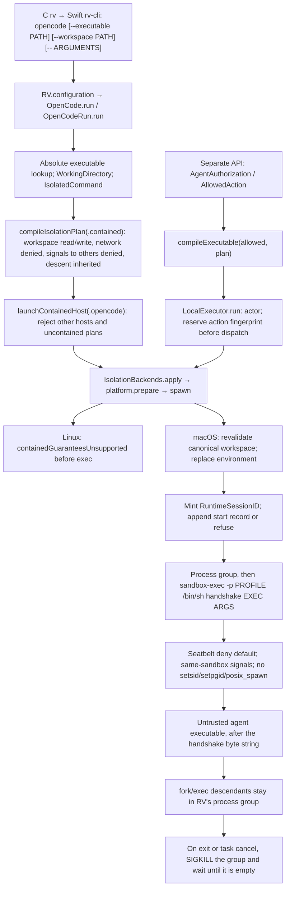

# RV runtime security boundary

Last updated: 2026-09-21. Audit base: `854e69103333a65e86deacac853f915adc450868`, with the uncommitted hardening pass described in [the acceptance matrix](runtime-acceptance.md). **Release status: NOT SATISFIED.** The implemented macOS containment is a deny-default Seatbelt scoped to the workspace, with the system paths required to start programs left readable. It is not a complete agent capability system.

## Implemented execution paths

Contained macOS launch mints a `RuntimeSessionID` before spawn and appends it to `~/.config/rv/runtime-sessions.jsonl`. That identifier is not the hook `SessionID`, and the launch API does not accept a caller-chosen value. It is not yet bound to policy lookup or a full audit stream. `rv <agent>` currently means the single registered `rv opencode` subcommand. Other agent hosts are not launchable through this door. The selected executable need not be a verified OpenCode binary; `--executable /bin/sh` is deliberately supported for testing. `HookHost.opencode` identifies the launch adapter, not a principal.

`LocalExecutor.perform` is an independent authorized-action API. It is not called for the OpenCode process or its tools. Agent-created descendants do not re-enter `perform`, policy evaluation or approval. Their inherited kernel restrictions are the only RV containment applied to those operations. Hook evaluation/history elsewhere in RV does not establish mediation of this process tree.

The general `IsolationBackends.apply` API still implements explicit observed/mediated execution without a sandbox. `launchContainedHost` and `LocalExecutor.run` reject these modes, and the CLI constructs contained plans. This is a restricted launch door, not proof that every use of RV's library APIs is supervised.

## Components and trust assumptions

| Component | Trust and concrete responsibility |
|---|---|
| RV CLI, `OpenCodeRun`, domain compiler, isolation backend and executor | Trusted code. Validate launch input and request the fence. They have the invoking user's ambient authority. |
| macOS kernel and `/usr/bin/sandbox-exec` | Trusted enforcement/loader path. The kernel enforces the generated write rules on the process and descendants. |
| Linux kernel, helper, dynamic loader and linked libraries | Trusted pre-isolation path. Helper must be an executable regular file named `rv-isolation-exec` outside the workspace. This is a path check, not cryptographic authentication, ownership validation or an inode-pinned launch. |
| Workspace and agent executable/arguments | Untrusted work. The host/operator deliberately selects the write root and executable. Agent-written scripts, replacements, shebangs and descendants are untrusted. |
| Parent directory tree and installed RV/helper | Assumed stable and outside adversary write authority while preparing and launching. The audit has not established protection against a same-user external attacker replacing these resources. |
| Inherited standard handles | Explicitly passed by host launch. They remain capabilities to their underlying resources; RV does not classify, attenuate or audit them. `apply`/`perform` discard all three by default. |
| Host services, Unix sockets, system processes and credentials | Not isolated by the current capability model. OS permissions still apply; RV does not add default-deny access rules for them. |
| Hook request `SessionID` | Optional validated nonempty self-declared string, not an authenticated runtime identity. It must not become a credential/wallet authority without a new binding. |

The C frontend now locates its sibling `rv-cli` from the running executable path (`_NSGetExecutablePath` on Darwin, `/proc/self/exe` on Linux), not caller-controlled argv0 or HOME. Linux Swift helper resolution uses only the `/proc/self/exe` sibling; it has no argv0/bundle fallback on Linux. Legacy lookup is confined to the non-Linux conditional branch. Darwin/Linux C tests and the staged PATH CLI proof validate the corrected dispatch. These checks do not authenticate file ownership/content or eliminate executable replacement races.

An attacker inside the write root may also find host-created hardlinks to resources outside it. This violates the intended file boundary on the tested macOS host: changing the workspace alias changed the outside file. Trusted workspace preparation is not a proven substitute for kernel enforcement and this remains a release blocker.

## RV policy, RV checks and OS enforcement

**RV policy:** `Sources/RVDomain/Isolation.swift` defines closed enums and immutable plans for observed, mediated and contained modes. Contained means `.workspaceScoped(workspace)`, network `.denied`, process `.hostSignalsDenied`, and descent `.inherited`. These are isolation intentions, not authenticated per-agent capabilities. `compileIsolationPlan` is a pure function of its typed input. Backend compilation additionally resolves filesystem paths, so its output depends on the current filesystem. Landlock compilation of that plan fails closed.

**RV launch checks:** `IsolatedCommand` rejects relative/empty executables and embedded NULs in argv. Contained prepare/run checks reject `/`, nonexistent and non-directory workspaces, unsafe paths, and a caller alias retargeted between prepare and spawn. The spawn boundary replaces the environment with `PATH=/usr/bin:/bin`, `LANG=C`, `LC_ALL=C`, `HOME=<workspace>` and `TMPDIR=<workspace>`. Ambient secret values, loader variables, interpreter variables, proxy/socket references and search paths are not forwarded. A shell can add its own bookkeeping variables. This restricts inherited environment authority; it does not hide host files or network services.

**Seatbelt enforcement:** `SeatbeltProfile.swift` generates `(deny default)`. It allows `process-exec`, `process-fork`, `signal` inside the same sandbox, `sysctl-read`, unfiltered `mach-lookup`, `file-read-data` of the root inode, `file-read-metadata` on `/private`, `/tmp`, `/var`, and `/Users`, and file read/map/ioctl on `/usr`, `/bin`, `/System`, `/Library`, `/dev`, plus read/write of the canonical workspace. It denies `setpgid` (syscall 82), `setsid` (147), and `posix_spawn` (244) so a descendant cannot leave the process group RV owns. `fork` and `execve` stay allowed. The granted executable is an extra literal read/map allow, including its realpath. Actual macOS tests deny ordinary outside reads and writes, symlink reads and writes, relative traversal, interpreter and shell wrappers, loopback and public TCP, UDP, IPv6, Unix sockets, and DNS. `kill` of another test-owned process is denied. Quotes and backslashes in profile paths are escaped; NUL, newline, and root paths fail validation. A workspace regular file with link count greater than one refuses launch. That scan is not a kernel inode rule. `mach-lookup` is not a closed IPC policy. Linux does not apply this profile.

**Landlock enforcement:** the C shim handles write-class filesystem bits, including `REFER` and `TRUNCATE`, and requires ABI 3. It sets `no_new_privs`, resolves the canonical workspace with `openat2(RESOLVE_NO_SYMLINKS | RESOLVE_NO_MAGICLINKS)`, then applies `landlock_restrict_self` before `execve`. Helper startup closes descriptors above 2 using `close_range`, failing closed if that fails. No read/execute/network rules, namespaces, seccomp, cgroups or PID controls are installed by RV. Docker's namespaces/seccomp/network restrictions in the audit fixture belong to Docker and are not RV guarantees. Actual Landlock enforcement was **not available** on the tested Linux kernel; only unsupported-kernel fail-closed behavior and separately labeled C setup tests were observed.

The [Linux kernel Landlock API documentation](https://docs.kernel.org/userspace-api/landlock.html) describes inherited restrictions and limitations for descriptors opened before sandboxing. It is platform background, not evidence that RV applied those controls on a supported kernel.

The code does not support host/domain network grants. No hostname allowlist should be inferred from Seatbelt or its current profile. A future domain policy needs an enforcement layer that also handles IP connections, DNS, resolution changes and direct sockets. This audit proves neither that Seatbelt alone can express that future policy safely nor that such a broker exists in RV.

## Failure and lifecycle limits

1. Invalid commands, workspace checks and unavailable backends return typed errors before inner execution; marker tests verify the covered paths. A failed session-record write does not start the contained command. An invalid Seatbelt profile returns `seatbeltNotEstablished` and does not run the inner command.
2. A Seatbelt `IsolatedRunResult` is returned only after the in-sandbox wrapper writes a nonce on an inherited pipe. The inner program's exit status is not that proof. Linux helper exits 125/126 are still convention codes and are not a production contained success: Linux contained launch returns `containedGuaranteesUnsupported` before exec.
3. `LocalExecutor` records an action fingerprint before a potentially effectful dispatch. An ambiguous failure cannot replay the same authorization in that executor. Pre-dispatch cancellation consumes nothing. Cancellation during a contained run terminates the process group and returns `cancelled`. Another executor is a separate deduplication scope.
4. On macOS, RV places the Seatbelt process in its own process group, kills that group when the immediate child exits or the Swift task is cancelled, and does not return success while the group still has a live member. A background child, a nested shell, `setsid()`, and a double-fork no longer keep workspace write authority after return. `posix_spawn` with `POSIX_SPAWN_SETSID` is denied inside the profile because a scanner cannot see that child before it is reparented. If the RV process itself is killed with SIGKILL, this cleanup does not run, and the group can keep running.
5. A real isolated shell was denied `kill` of a harness-owned unrelated process. It can signal processes in its own sandbox. An agent directly killing the RV supervisor or manipulating it through available IPC is not excluded by current process policy. `mach-lookup` stays unfiltered. A launchctl service-submission probe exited 1 without the outside marker; its cause was inconclusive and cannot count as a kernel denial. Debugger attachment, privilege operations and host process inspection have not received sufficient probes.
6. Inherited stdio may reference files, sockets or terminals already opened with authority. The macOS CLI fixture showed a supplied descriptor above 2 did not mutate its outside fixture; it does not certify arbitrary descriptor inheritance or stdio safety. Linux C descriptor tests stub Landlock and do not prove descriptor behavior under an actual restricted kernel.
7. Canonical path revalidation closes a demonstrated alias-retarget window. It does not pin the workspace/executable/helper inode across every subsequent race, prevent same-path directory replacement, or authenticate the helper. The direct dynamic helper can execute an injected loader constructor before `main`; production Swift spawn strips the relevant environment. An actual Linux Swift startup probe confirms the constructor marker stays absent and the unsupported kernel prevents inner execution. Positive enforcement on a supported kernel remains unproven.
8. Workspace files include `.git/hooks`, shell startup files and any RV policy/config/binary placed there. These are writable. RV does not reserve protected control-plane subpaths or prevent an outside same-user controller from consuming those files later.
9. The launch path appends a start record (runtime session id, host when present, canonical workspace, backend, start time) before spawn. It is not a full audit stream: no policy id, capability set, or kernel-deny events. If that start record cannot be written, the contained command is not started.

## Remaining work, by release impact

| Priority | Gap | Required next evidence |
|---|---|---|
| Release blocker | Default-allow reads, network, IPC and process interaction | Typed capability compiler and real negative tests for secret reads, IPv4/IPv6/TCP/UDP/DNS/Unix sockets and host processes on both supported OSes. |
| Release blocker | Runtime session id is not yet bound to policy or a full audit stream | Two identities with differing authority; structured X/Y/Z/P/S events. Start-record failure already refuses launch. |
| Release blocker | Descendants do not re-enter semantic authorization. Process-group cleanup does not run if RV is SIGKILLed | Defined OS-vs-broker boundary for tool exec. Prove cleanup when the supervisor is killed. |
| Release blocker | macOS outside-file mutation through preexisting hardlinks; unclassified inherited handles | Kernel-enforced or deliberately reduced filesystem/descriptor design with regression effects, including stdio and inode aliases. |
| Release blocker | Linux helper exit codes 125/126 are still convention codes, and that path does not execute | Keep `containedGuaranteesUnsupported` until Linux can enforce the same lifetime and sandbox contract. macOS Seatbelt establishment is a pipe nonce, not the child exit status. |
| Release blocker | Linux enforcement unproven; no process/network boundary | Actual Landlock ABI >= 3 Linux host and CI/container runs; fail-closed required namespaces/seccomp if those become the selected mechanisms. |
| Important hardening | Filesystem path/executable/helper replacement races and helper provenance | Inode-stable grant/launch design and adversarial race tests; trusted ownership/install validation. |
| Important hardening | TMPDIR/HOME mapped to workspace; broad shared write root | Deliberate temporary-directory permissions and cleanup tests; protected control-plane paths. |
| Important hardening | CLI compatibility under minimal environment and platform packaging | Real OpenCode interactive smoke test with explicit credential/network requirements; packaged Linux launcher test. |
| Future enhancement | Central enterprise ingestion and additional agent adapters | Build on authenticated identity and typed audit events after blockers are closed. Secrets, MCP credentials and wallets remain out of scope for this pass. |

See [the criterion matrix](runtime-acceptance.md), [the attack inventory](adversarial-inventory.md), and the appended [phase-10 completion notes](../rv-agent/handoffs/phase-10-contained-host-launch.md).
