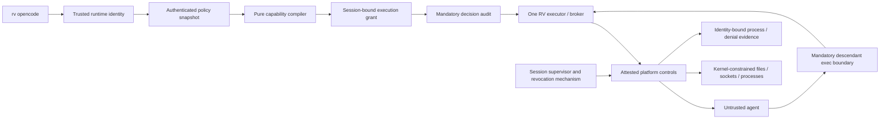

# RV runtime security remediation — implementation handoff

Date: 2026-09-21. Repository: `/Users/chriskarani/CodingProjects/rv`.

**Release remains blocked. Plan status: `draft` pending the platform feasibility gate in U02.** U01–U08 define concrete foundation work; subsequent platform work must use the mechanism proved in U02. This document is a work order, not evidence that its proposed architecture exists.

Start from `main` at `854e69103333a65e86deacac853f915adc450868` **plus the current uncommitted hardening changes**. Do not reset to that commit and discard the launcher, regression tests or evidence. The existing modified `Package.resolved` and untracked `Scripts/__pycache__/` predate the hardening pass. Additional concurrent edits, including `RVEngine/Unwrap.swift` and related tests, appeared during planning; preserve and inventory those too. This plan does not review or certify that separate work.

Read these first:

- [Acceptance matrix: all 132 criteria](runtime-acceptance.md).
- [Actual architecture and security boundary](runtime-boundary.md).
- [Adversarial inventory and observed escapes](adversarial-inventory.md).
- [Initial matrix, preserved before code changes](runtime-acceptance-initial.md).
- [Existing phase-10 handoff and completion appendix](../rv-agent/handoffs/phase-10-contained-host-launch.md).

## 0. Goal and scope

Make an RV-managed agent possess only deliberately granted authority, with authenticated identity, bounded capability lifetime, mandatory execution control and auditable fail-closed enforcement on each supported platform.

Fix the runtime boundary, not unrelated hook, UI or policy features. Keep functional Swift, immutable domain values, exhaustive enums, typed errors, explicit state transitions, dependency injection and correct `Sendable`/actor isolation. Do not build secrets, wallets, MCP credential provisioning or enterprise ingestion in this program.

**First action for the implementing agent:** preserve and inventory this working tree; run U01 to reproduce the evidence; run U02 before claiming Seatbelt or Landlock can meet the entire contract. A platform unable to enforce a required guarantee must reject strict launches. Such rejection is a safe intermediate result, **not completion of the requested runtime milestone**.

## 1. Tree-truth ledger

`partial` below means present in the working tree, not committed or release accepted. Do not reimplement present fixes without a failing regression. New paths and commands later in this plan are explicitly proposed.

| ID | Slice / finding | Status | Current implementation and evidence | Remaining fix |
|---|---|---|---|---|
| T01 | CLI registration | partial | `Sources/RVCLI/Commands/OpenCodeCommand.swift`, `RV.swift`; `OpenCodeCommandTests`; actual OpenCode 1.18.31 `--version` smoke | Keep `rv opencode`; connect it to authenticated runtime/policy/audit. Other hosts are not supported launchers. |
| T02 | Input and environment validation | partial | `IsolationApply.swift`, `LaunchBoundaryRegressionTests.swift`: NUL rejection, canonical-root revalidation, replaced child environment | Race-stable resources, explicit runtime dependencies, private HOME/temp and classified stdio. |
| T03 | Ordinary write fence and inheritance | partial | Actual macOS Seatbelt tests, interpreter/shebang/recursive CLI probes | Reads, hardlinks, network, processes, protected control data and lifetime remain unsafe. |
| T04 | One-executor dispatch protection | partial | `LocalExecutor.swift`, `ExecutorLifecycleRegressionTests.swift`: reserve before apply, concurrent single dispatch, pre-dispatch cancellation | Identity-bound unique grants, cross-executor replay scope, expiration/revocation and running cancellation. |
| T05 | Trusted-location improvements | partial | `rv-c/rv.c`, `LandlockApply.swift`: actual executable path instead of argv0/HOME; C tests pass on Darwin/Linux | Authenticate installation; bind resource identity across launch; prevent replacement races. |
| T06 | Linux setup hardening | partial | `landlock_apply.c`, helper: no-new-privileges, `openat2`, fd cleanup; actual unsupported-kernel refusal | Actual supported-kernel proof, read/network/process confinement, namespaces/seccomp and complete startup protocol. |
| T07 | Linux helper distribution | partial | `install.sh`, `Scripts/release.sh`, installer tests | Build/install/test complete Linux release artifacts in release CI. |
| T08 | Typed capability policy and trusted principal | open | `RVDomain/Isolation.swift` describes only write containment; hook `SessionID` is self-declared | U03–U06. |
| T09 | Mandatory execution and lifetime ownership | open | CLI bypasses `LocalExecutor`; descendants spawn directly; background and SIGKILL markers survive | U02, U08, U14, U17–U19. |
| T10 | Structured runtime audit | open | Hook history exists; mandatory launch/descendant audit does not | U07, U11, U18, U20. |
| T11 | Comprehensive release evidence | partial | Focused 142 tests passed; CLI 9 PASS / 10 GAP / 5 NOT-TESTED; Linux 6 PASS / 3 GAP | Convert gap witnesses into negative security tests; fill omissions; supported Linux evidence. |
| T12 | Repository gate health | open | Broader 652-test run had 3 failures reproduced at pristine HEAD; preflight fails on ignored historical handoff | Hermetic fixtures and correct preflight inputs, then real unsuppressed gate. U23. |
| T13 | Secrets, wallets, MCP and enterprise products | deferred | No security-boundary certification for those consumers | Only start after this release gate passes. |

Evidence is tied to [source hashes](evidence/source-sha256.json) and [verification notes](evidence/verification.txt). Rehash after implementation; never relabel the old evidence as a new run.

## 2. Locked decisions and feasibility gate

| Decision | Required choice | Why / owner |
|---|---|---|
| Default mode | Managed-agent launches require all security controls declared by their effective policy. Missing policy is an error; no permissive default and no automatic observed/mediated fallback. | U03, U08. A host operator must create an explicit minimal policy. |
| Adapter versus principal | `opencode` identifies an adapter. Runtime-issued agent/session/execution identities are distinct from adapter names, argv, environment and hook `SessionID`. | U05. An opaque random string alone does not authenticate a caller. |
| Policy ownership | Trusted runtime orchestration belongs in `RVService`; immutable definitions in `RVDomain`; OS effects in `RVIsolation`; CLI composes them. `RVHooks` remains adapter code. | U03–U08. Avoid a second policy interpreter in CLI or C. |
| Effective authority | Compile explicit grants plus a named, minimal runtime baseline into one immutable, inspectable manifest. Children receive no broader authority. | U03–U04. Libraries, executables, devices, IPC, stdio and environment count as authority. |
| Network first slice | Default deny all network, including loopback, DNS and Unix sockets. If an unrestricted grant is implemented, it must be explicit and audited. Reject host/domain allowlists until a mandatory enforcing broker exists. | U13, U16. Do not sell environment proxy variables or DNS filtering as confinement. |
| Execution ownership | Every child execution must cross an unavoidable RV authorization boundary. Inherited restrictions, hooks, PATH wrappers and post-exec observation alone do not satisfy criterion 1.1. | U02, U14, U17–U18. Interpreters can also access resources without another exec; OS resource rules remain necessary. |
| Filesystem meaning | Preserve the requested meaning of an explicitly granted live `/repo` tree. Do not silently substitute a copied workspace. Reject a live-tree grant whose inode-alias/race safety cannot be established. | U09. A separate isolated workspace may be offered only as an explicit policy mode with separate export authorization. |
| Runtime/control data | Policy, audit, executable trust material and supervisor IPC live outside agent-writable grants; nested or aliasing grants are rejected. Repository control files require explicit handling. | U09–U10. No trusting an agent-written config during a running session. |
| Startup | Separate prepared intent, controls applied, authorized dispatch, confirmed exec and child exit. A wrapper PID or exit code is not isolation attestation. | U11. Status 125/126 from a payload must remain ordinary payload exits. |
| Lifetime | Grants belong to a runtime session and generation. Closing/revoking it stops future dispatch and removes active authority through a proven platform mechanism. | U06, U19. Process-group cleanup alone is not proof against daemonization or supervisor SIGKILL. |
| Failure | A failure to enforce, authenticate, record required audit, or maintain supervision stops new execution and triggers containment teardown. | U07, U11, U18–U21. No continue-on-error security branches. |
| Platform parity | Require equivalent externally tested guarantees, not identical APIs. Feature-detect the required enforcement set; reject missing features. | U02, U12–U17. Container-provided isolation is not RV evidence. |
| Unproven mechanism | Default outcome is `unsupportedGuarantee` and no untrusted execution. Record the missing guarantee; do not invent a weaker successful mode. | U02. Stronger isolation, an entitled service or VM backend requires a bounded reviewed extension if native mechanisms cannot pass. |
| Policy change | A running grant cannot broaden in place. Reauthorize under a new policy snapshot and generation; revoke old authority as required before replacement. | U04–U06, U19. No stale-session permission carryover. |

### U02 must resolve these questions with executable probes

1. **macOS mandatory mediation:** which deployable mechanism blocks an unapproved descendant exec before user code runs, attributes it, and prevents bypass through native spawn APIs, interpreter syscalls, IPC services and recursive RV? Establish availability, entitlements/install requirements and failure behavior. Seatbelt profile generation alone is not an answer.
2. **Process and service boundary:** which host process inspection, signals, debugger attachment, privilege transitions, Mach/XPC/launchd operations and Unix socket paths remain possible? Document unavoidable OS metadata separately from prohibited interaction.
3. **Live-tree inode safety:** how are preexisting hardlinks, aliases planted after validation, parent replacement, mounted subtrees and descriptor aliases prevented throughout a grant? A one-time `st_nlink` scan or canonical path check is insufficient.
4. **Lifetime under failure:** what revokes authority when the CLI, session supervisor, tracker or independent guardian dies? Specify each failure separately; an independently running guardian is still trusted infrastructure whose own death requires analysis.
5. **Audit completeness:** what mechanism captures required execution and denial events without losing them before enforcement? A best-effort OS log stream cannot be described as complete mandatory audit.

For each supported OS, retain the experiment, positive control, negative effect, kernel/build version and mechanism limitations in proposed `docs/security/runtime-mechanism-decision.md`. Bind the chosen backend to typed supported-guarantee values. If these probes fail, leave the relevant matrix rows NOT SATISFIED, keep strict launch closed, and produce a follow-on design for the missing mechanism. Do not spend the rest of the program making a green banner around an impossible claim.

Platform references are background, not RV proof: [Landlock API](https://docs.kernel.org/userspace-api/landlock.html) describes inheritance, ABI-dependent coverage and preopened-resource limitations; RV must reject a missing required right rather than copy a best-effort fallback. [Seccomp documentation](https://docs.kernel.org/userspace-api/seccomp_filter.html) explains why syscall filtering is one component rather than a complete sandbox. [Apple Endpoint Security](https://developer.apple.com/documentation/endpointsecurity) is a candidate to investigate, not an assumed available or sufficient dependency.

## 3. Global reject list

- No `allow default` secure profile, ambient home/network/process authority, catch-and-run-unsandboxed path, or unsupported-right masking that broadens access.
- No self-declared identity, policy selected from an agent-controlled name, agent-set environment authority, or authorization based only on executable basename/command substrings.
- No check-then-use path validation presented as inode binding; no scan-only hardlink guarantee; no accepting arbitrary inherited stdio as harmless.
- No claiming every command is mediated because the initial agent uses RV or descendants inherit a sandbox. No policy approval of one argv treated as approval of arbitrary interpreter behavior.
- No exit-code attestation, stdout startup protocol, best-effort required audit, PID-only identity susceptible to reuse, or process polling described as complete child ownership.
- No passing security test whose payload did not run. Every denial probe needs a positive execution control and an observed effect check.
- No treating `knownGap` success, missing interpreter, SKIP, unsupported kernel, timeout or inconclusive result as acceptance. Preserve historical witnesses; change their security expectation when fixed.
- No deleting failing tests, excluding failures to make the gate green, reusing stale logs, or using Docker's own namespaces/seccomp as evidence of RV's controls.
- No real credential contents, arbitrary host victim processes or uncontrolled public targets in fixtures. Use synthetic secrets and owned targets.
- No unrelated redesign, implicit compatibility project, new credential/wallet system, or publishing/committing without the operator's requested workflow.

## 4. Executable oracle contract

All commands run from the repository root. Serialize SwiftPM builds. Retain source manifest, OS/kernel/architecture, backend feature probes, exact argv, result, safe structured events and fixture outcomes per run. Never retain secrets.

### Existing commands — baseline, not expected green acceptance

```sh
Scripts/swift-6.4 test --filter 'RVIsolationTests|IsolationPlanTests|OpenCodeCommandTests|installSh_'
Sources/rv-c/tests/run.sh
python3 -B Scripts/runtime-cli-proof.py --cli .build/security-audit/stage/rv
python3 -B Scripts/isolation-linux-adversarial.py --output .build/security-audit/linux/reviewed
Scripts/gate.sh RVIsolationTests RVDomainTests RVCLITests
```

The staged executable must be freshly rebuilt from this tree before using that path. The existing CLI/Linux scripts currently return 2 for GAP. A Landlock-unavailable Docker host can prove rejection only.

### Proposed oracle interface — implemented by U01, not currently available

Extend the existing CLI harness with `--case NAME`, `--require-closed` and `--strict-policy-fixture`. Add `Scripts/stage-runtime-security.sh` to build and stage the real C frontend, Swift CLI, helpers and test payloads in `.build/runtime-security/stage/`. It must fail if a required binary is absent. Fixtures construct temporary trusted policy/audit roots, synthetic homes, owned sockets/processes and explicit capability sets; no caller's production policy or credentials are used.

`--strict-policy-fixture` targets the strict product launch path introduced by U08, not a test-only bypass. `--require-closed` exits nonzero for FAIL, GAP, NOT-TESTED, missing expected case, timeout or missing required platform feature. The initial old mode may remain solely for historical witness reproduction. Tests must not mutate production policy to get an otherwise unsupported strict launch accepted.

Use these command aliases below; they are documentation shorthand, not shell functions:

| Alias | Exact command / expected outcome |
|---|---|
| `BUILD` | `Scripts/stage-runtime-security.sh` → 0; hash manifest names every staged executable. |
| `UNIT(filter)` | `Scripts/swift-6.4 test --filter 'filter'` → 0 for the stated test suite; replace `filter` with the unit's concrete suite name. Require enumeration and execution of every named suite/case, not just an aggregate exit code. |
| `LIVE(case)` | `python3 -B Scripts/runtime-cli-proof.py --cli .build/runtime-security/stage/rv --strict-policy-fixture --require-closed --case case` → 0 with payload positive controls and all named negative effects denied. Replace the final `case` with the specified name. |
| `ALL-LIVE` | `python3 -B Scripts/runtime-cli-proof.py --cli .build/runtime-security/stage/rv --strict-policy-fixture --require-closed` → 0; no required omission on that OS. |
| `LINUX` | `python3 -B Scripts/isolation-linux-adversarial.py --output .build/runtime-security/linux --require-enforcement` → 0 on supported Linux; U01 adds this flag and a native-host execution mode. No Landlock stubs count toward enforcement. |
| `GATE` | `Scripts/gate.sh RVIsolationTests RVDomainTests RVPolicyTests RVServiceTests RVHistoryTests RVCLITests` → 0. Resolve module naming against `Package.swift`; do not omit a changed target. |

Each named LIVE case below is an independently selected group of real launcher probes, not one assertion. U01 owns harness dispatch; later unit owners add the named cases serially. A case that does not exist is an error. Library-only compiler/model units use unit tests, then U08 proves composition through the CLI. Platform cases are never silently skipped in that platform's required release job.

U01 must maintain an expected test/case inventory and compare it with actual discovery and executed results. Zero tests, an absent regex alternative, a missing required Python `test_*.py` case, or an OS-conditional suite excluded from its required platform is failure. Existing suite names do not always match filenames: use `IsolationApplyLandlockTests` and the free-function prefix `installSh_`. New suites must use the exact names specified below.

### Intermediate evidence versus integrated acceptance

Avoid a dependency cycle: the strict public launcher cannot run positive fixtures until execution mediation, supervision and mandatory audit are integrated. It must remain fail-closed while these pieces are incomplete.

- `local-complete / integration-pending`: a unit's pure tests or **actual kernel integration fixtures invoking its production backend/helper** pass. These fixtures use isolated synthetic resources and trusted test issuance; they do not enable an incomplete public launch mode. Record exactly which controls they exercise. A generated profile, stubbed syscall or mocked process is not a kernel fixture.
- `integrated`: that unit's listed LIVE case passes through the fresh public C/Swift CLI with the full required controls. This status is necessary for release acceptance.
- `blocked`: neither the required mechanism nor its safe execution can be proved. Retain the failed criterion and prevent strict launches on that configuration.

U08's immediate product oracle is proposed `LIVE(runtime-entry-refusal)`: every missing/invalid/unavailable required control prevents any payload work. It does **not** stand in for the later positive `runtime-entry`/identity/grant oracles. U09–U17 must run their named Swift integration suites with actual native helper/kernel effects for local completion; their positive CLI LIVE commands are registered now and deliberately remain integration-pending. W2 may hand off only with these native backend proofs and continued CLI refusal. U18–U20 integrate those boundaries; U21 runs **all deferred LIVE cases**, not just its own cases. U22 repeats against installed packages; U24 cannot close with any integration-pending unit.

The implementor must carry the two statuses in each handoff. Do not demand a successful strict payload as a prerequisite for building the boundary that first makes strict execution possible; do not call intermediate backend proofs product acceptance either.

The final oracle pack is `BUILD`, `ALL-LIVE` on macOS and supported Linux, `LINUX` on supported Linux, the unsupported-feature rejection suite on deliberately incapable environments, `GATE`, `Sources/rv-c/tests/run.sh`, and the installed OpenCode smoke in U22. Unit filters alone never complete a feature unit.

## 5. Ownership and scheduling

Use three sequential waves of eight units. Each is `mode=full`, `max_units=8`, `max_parallel=1`, `agent_budget=1024`. Serial implementation is deliberate: several security seams share launch/helper/compiler files. Independent read-only reviews may run in parallel. Set every unit's `parallel_safe=false`; do not infer write parallelism from the table.

Paths below are write leases for the named unit, not a license for concurrent modifications. New files are marked `(new)`. Sequential later owners may extend earlier files after the previous unit closes. Any additional write path requires updating the unit scope before editing.

| Path / responsibility | Exclusive owner while active | Wave |
|---|---|---|
| Evidence harness/stager; fixture dispatch | U01; later unit owns only its named case under the same serial lease | W1–W3 |
| Mechanism decision and feasibility probes | U02 | W1 |
| Capability policy types/parser; deterministic compiler | U03 → U04 | W1 |
| Runtime identity / policy binding; grant state | U05 → U06 | W1 |
| Runtime audit schema/sink | U07; ingestion/explanation later U20 | W1, W3 |
| CLI/service/host-launch composition | U08; broker integration later U18 | W1, W3 |
| Filesystem grant preparation/protected roots | U09 | W2 |
| Trusted installation, environment, descriptors | U10 | W2 |
| Spawn/helper startup protocol | U11 | W2 |
| Seatbelt filesystem/baseline; network/IPC; process mediation | U12 → U13 → U14 | W2 |
| Linux filesystem/namespaces; networking; process/seccomp/exec | U15 → U16 → U17 | W2, W3 |
| Executor/broker/tracker; teardown/revocation | U18 → U19 | W3 |
| Race/concurrency/failure campaigns | U21 | W3 |
| Release packaging, supported-platform CI, OpenCode smoke | U22 | W3 |
| Existing test hermeticity and preflight | U23 | W3 |
| Final attack inventory, matrix and handoff | U24 | W3 |

## 6. Implementation waves

For every unit: first add a failing effect-based regression, implement the minimum coherent fix, run its gates, then obtain code/security review. Pure domain tests may precede platform availability. `Residuals allowed` are local intermediate limits; they never waive a final acceptance criterion. Every unit below has `fat=no` at its stated seam; if U02 selects a mechanism requiring a new service/VM or more than one independently deployable boundary, split that extension into a separately reviewed plan before implementation.

### W1 — Establish the authority model and one managed launch path

Depends on waves: none. Product oracles: U01 baseline reproduction; U08 `BUILD` + `LIVE(runtime-entry-refusal)`. Foundation handoff is ready when local tests and the strict-path refusal evidence pass, U02 has a reviewed supported-mechanism decision or an explicit blocked outcome, and no provisional enforcement is exposed as supported. Preserve integration-pending states per §4. A blocked U02 permits independent pure foundation work, but **does not authorize the W2 native implementation or declare W1 release-ready**.

#### U01 — Reproduce and make the release oracle usable (`audit_gapfill`)

- **Goal:** preserve current fixes and make missing security evidence mechanically fail.
- **Code paths:** `Scripts/runtime-cli-proof.py`, `Scripts/isolation-linux-adversarial.py`, `Scripts/stage-runtime-security.sh` (new). **Test paths:** `Tests/SecurityHarnessTests/` (new harness self-tests).
- **Acceptance:** (1) Existing results reproduce or changes are explained against current hashes. (2) Proposed selectors/strict flags reject unknown, missing, skipped, timed-out and GAP cases, including under `python -O`. (3) Native supported-Linux mode and fresh staging exist; fixture cleanup targets only owned resources.
- **Composition acceptance:** the stager launches the actual C → Swift → helper product path; legacy witnesses remain available without receiving strict acceptance credit.
- **Live smoke:** `BUILD`; existing CLI/Linux baseline commands above retain honest nonzero gap outcomes.
- **Gates:** focused existing Swift command; `python3 -m unittest discover -s Tests/SecurityHarnessTests`; harness `--help`; `Sources/rv-c/tests/run.sh`.
- **Depends on:** none. **Parallel-safe:** false. **Reject:** weakening a witness to force exit 0. **Residuals allowed:** known product gaps remain red. **Fat:** no.

#### U02 — Prove the platform mechanism, or block it (`audit_gapfill`)

- **Goal:** resolve the five feasibility questions in §2 before backend promises are encoded.
- **Code paths:** `docs/security/runtime-mechanism-decision.md` (new), `Scripts/runtime-feasibility/` (new disposable probes). **Test paths:** `Tests/SecurityHarnessTests/test_feasibility.py` (new).
- **Acceptance:** (1) Each OS has a documented mandatory execution, filesystem alias, process, lifetime and audit mechanism with executable probes. (2) Deployment prerequisites and failure modes are recorded; unsupported combinations have absent untrusted markers. (3) Unproved guarantees remain blocked with a bounded follow-on plan, not a fabricated backend success.
- **Composition acceptance:** probes exercise a native payload outside the cooperative agent SDK; library hooks are not accepted as the boundary.
- **Live smoke:** run every recorded probe command from the decision document on its named platform; include bypass, crash and positive controls. Final command names must be recorded before reviewing U02.
- **Gates:** harness self-tests; independent platform/security design review of the retained effects and supported-guarantee table.
- **Depends on:** U01. **Parallel-safe:** false. **Reject:** selecting mechanisms solely from API names or generated profiles. **Residuals allowed:** explicit blocked platform, but no final milestone completion. **Fat:** no; bounded feasibility, not implementation of a new virtualization platform.

#### U03 — Typed capabilities and strict policy decoding (`implement`)

- **Goal:** represent exactly what the operator grants.
- **Code paths:** `Sources/RVDomain/Isolation.swift`, `Sources/RVDomain/RuntimeCapabilities.swift` (new), `Sources/RVDomain/RuntimePolicy.swift` (new), `Sources/RVPolicy/RuntimePolicyDecoder.swift` (new). **Test paths:** `Tests/RVDomainTests/RuntimeCapabilitiesTests.swift`, `Tests/RVPolicyTests/RuntimePolicyDecoderTests.swift` (new).
- **Acceptance:** (1) Validated filesystem read/write/execute grants, network mode, process/IPC permissions, stdio/runtime baseline and session constraints are explicit immutable types. (2) Unknown versions/keys/values, missing policy, invalid combinations and unsupported capability requests reject with typed errors. (3) Absent grants deny; no loose substring matching or unchecked boolean combinations control authority.
- **Composition acceptance:** reuse established policy parsing/domain conventions, but do not treat hook approvals as a runtime policy automatically.
- **Live smoke:** N/A for pure values/decoder; U08 must exercise the same decoder through `rv opencode`.
- **Gates:** `UNIT(RuntimeCapabilitiesTests|RuntimePolicyDecoderTests|IsolationPlanTests)`.
- **Depends on:** U01; U02's supported-guarantee vocabulary before exposing support. **Parallel-safe:** false. **Reject:** permissive unknown fields or built-in all-host grant. **Residuals allowed:** no OS enforcement yet. **Fat:** no.

#### U04 — Deterministic capability-to-enforcement compiler (`implement`)

- **Goal:** one pure interpretation of effective authority, separate from resource acquisition.
- **Code paths:** `Sources/RVDomain/Isolation.swift`, `Sources/RVDomain/RuntimePolicyCompiler.swift`, `Sources/RVDomain/EffectiveRuntimePolicy.swift` (last two new). **Test paths:** `Tests/RVDomainTests/RuntimePolicyCompilerTests.swift` (new), `IsolationPlanTests.swift`.
- **Acceptance:** (1) Equivalent normalized policies produce identical ordered manifests and fingerprints; contradictory/unsupported grants fail. (2) Baseline grants, policy identifier/version and broadening relative to a prior manifest are explicit. (3) Pure compilation receives validated resource identities and feature support; it does not read live filesystem, clock, environment or global state.
- **Composition acceptance:** backends consume this manifest; neither CLI nor C reinterprets policy strings. Acquisition/validation effects are U09–U10.
- **Live smoke:** N/A pure compiler; U08/U20 exercise launch/explain against its output.
- **Gates:** `UNIT(RuntimePolicyCompilerTests|RuntimeCapabilitiesTests|IsolationPlanTests)`; permutation/equivalence and invalid-combination tests.
- **Depends on:** U03. **Parallel-safe:** false. **Reject:** treating plan intent as established controls. **Residuals allowed:** OS application pending. **Fat:** no.

#### U05 — Runtime-issued identity and authenticated policy lookup (`implement`)

- **Goal:** bind one concrete agent session to its trusted policy snapshot.
- **Code paths:** `Sources/RVDomain/RuntimeIdentity.swift`, `Sources/RVService/RuntimeIdentityIssuer.swift`, `Sources/RVService/RuntimePolicyResolver.swift` (new). **Test paths:** `Tests/RVServiceTests/RuntimeIdentityTests.swift`, `RuntimePolicyResolverTests.swift` (new).
- **Acceptance:** (1) Trusted issuance creates separate agent/session/execution identifiers; construction of authority-bearing context is restricted. (2) Caller binding uses the U02-approved authenticated connection/process credential, never a request string, env variable or PID alone. (3) Forged identity, wrong audience/session, swapped policy and another agent's handle are rejected.
- **Composition acceptance:** policy is loaded from a protected operator location and snapshotted; identity lookup cannot be redirected by workspace files. Child association is completed by U18.
- **Live smoke:** N/A issuance/lookup boundary until U08; `LIVE(identity)` is mandatory before this unit is considered integrated.
- **Gates:** `UNIT(RuntimeIdentityTests|RuntimePolicyResolverTests)`.
- **Depends on:** U03–U04. **Parallel-safe:** false. **Reject:** UUID-in-env authentication or reusing hook `SessionID` as principal. **Residuals allowed:** OS child identity binding pending U18. **Fat:** no.

#### U06 — Session-bound grants and atomic state transitions (`implement`)

- **Goal:** prevent replay, stale authority and accidental cross-session reuse.
- **Code paths:** `Sources/RVDomain/ExecutionGrant.swift`, `Sources/RVDomain/RuntimeSessionState.swift` (new), `Sources/RVIsolation/LocalExecutor.swift`, `ExecutableAction.swift`. **Test paths:** `Tests/RVIsolationTests/ExecutorLifecycleRegressionTests.swift`, `RuntimeGrantTests.swift` (new).
- **Acceptance:** (1) Grants bind identity, session generation, policy snapshot, allowed action and validity; unique grant IDs distinguish two deliberate identical commands. (2) One trusted owner atomically consumes a grant before effectful dispatch, including ambiguous failure; another executor cannot replay it. (3) Expired, revoked, closed or old-generation grants fail, using an injected monotonic time boundary for tests.
- **Composition acceptance:** preserve pre-dispatch cancellation semantics; make running cancellation an explicit transition delegated to U19, not a blocking wait shortcut.
- **Live smoke:** N/A state machine until integrated; U08/U21 `LIVE(grants)` proves real dispatch counts.
- **Gates:** `UNIT(RuntimeGrantTests|ExecutorLifecycleRegressionTests|LocalExecutorTests)`.
- **Depends on:** U05. **Parallel-safe:** false. **Reject:** process-global unbounded mutable registry or fingerprint-only identity. **Residuals allowed:** active OS authority revocation pending U19. **Fat:** no.

#### U07 — Structured audit model and mandatory durable sink (`implement`)

- **Goal:** make authorized dispatch contingent on successfully recording its decision.
- **Code paths:** `Sources/RVDomain/RuntimeAuditEvent.swift`, `Sources/RVHistory/RuntimeAuditSink.swift`, `RuntimeAuditJournal.swift` (new). **Test paths:** `Tests/RVHistoryTests/RuntimeAuditTests.swift` (new).
- **Acceptance:** (1) Versioned events carry agent/session/execution/grant IDs, policy and sandbox manifest IDs, safe action descriptor, decision/reason, time/order and process reference when known. (2) Required pre-dispatch append/durability failure refuses execution; unwritable/full/corrupt sink and backpressure are explicit errors. (3) Synthetic secrets in argv, env, policy fields and error messages never appear in events or diagnostics.
- **Composition acceptance:** sink stays outside writable grants; no agent-controlled audit routing; production events are distinct from test JSONL and hook history. Preserve the package's value-type rules: keep sink interfaces as values and place required serialized state in an allowed service owner, not an unsolicited actor/class in `RVHistory`.
- **Live smoke:** N/A sink library; U08 `LIVE(audit-failure)` must show no command marker when the real sink fails.
- **Gates:** `UNIT(RuntimeAuditTests)`; schema round-trip/order/redaction/fault tests.
- **Depends on:** U04–U06. **Parallel-safe:** false. **Reject:** raw argv/env logging, unkeyed low-entropy secret hashes, or swallow-and-continue. **Residuals allowed:** OS event ingestion pending U20. **Fat:** no.

#### U08 — Join `rv opencode` to the authenticated executor (`implement`)

- **Goal:** remove the separate unauthenticated managed-agent launch route.
- **Code paths:** `Sources/RVCLI/Commands/OpenCodeCommand.swift`, `Sources/RVService/AgentRuntime.swift` (new), `Sources/RVIsolation/HostLaunch.swift`, `LocalExecutor.swift`, `Package.swift`. **Test paths:** `Tests/RVCLITests/OpenCodeCommandTests.swift`, `Tests/RVServiceTests/AgentRuntimeTests.swift` (new); harness cases `runtime-entry`, `identity`, `grants`, `audit-failure`.
- **Acceptance:** (1) CLI launch goes through trusted identity → policy resolver → compiled capabilities → grant → mandatory audit → executor. (2) A proposed `--policy ABSOLUTE_PATH` selects operator policy before untrusted work; missing/malformed/untrusted policy and unsupported controls produce no payload marker. (3) Managed launch cannot select observed/mediated mode, alternate executor, or broader nested RV policy.
- **Composition acceptance:** keep existing passthrough argv and exit behavior for supported launches; other adapters remain explicitly unsupported. Secure startup may be unavailable until W2/W3 prove the required backend.
- **Live smoke:** immediately `BUILD` + `LIVE(runtime-entry-refusal)`. Register `LIVE(runtime-entry)`, `LIVE(identity)`, `LIVE(grants)` and `LIVE(audit-failure)` as integration-pending obligations that U21 must close after U18–U20. Early strict rejection is a startup test only.
- **Gates:** `UNIT(OpenCodeCommandTests|AgentRuntimeTests|HostLaunchTests|LocalExecutorTests)`.
- **Depends on:** U03–U07; U02 controls support claims. **Parallel-safe:** false. **Reject:** adding an optional secure side path while default managed launch still bypasses it. **Residuals allowed:** strict backend unsupported pending W2/W3, clearly reported. **Fat:** no.

### W2 — Establish kernel resource boundaries

Depends on W1 foundation and successful U02 mechanism decision for the target platform. Immediate product oracle: `BUILD` + `LIVE(runtime-entry-refusal)` while controls are incomplete. Local gates are each unit's actual backend/helper kernel suites below. W2 handoff requires those enforcement effects; all positive platform filesystem/network/process/startup LIVE groups remain mandatory integration-pending obligations for U21. Mandatory exec integration/lifetime still require W3. Do not equate partial resource enforcement with release readiness.

#### U09 — Filesystem grants, alias safety and protected resources (`implement`)

- **Goal:** make the granted filesystem objects match the operator's intended scope throughout their lifetime.
- **Code paths:** `Sources/RVIsolation/FilesystemGrantPreparation.swift`, `ProtectedRuntimePaths.swift` (new), `SeatbeltProfile.swift`, `LandlockRuleset.swift`. **Test paths:** `Tests/RVIsolationTests/FilesystemGrantTests.swift` (new), `RuntimeAdversarialTests.swift`; harness `filesystem-aliases`.
- **Acceptance:** (1) Read-only/read-write scope and exclusions protect outside inode contents and metadata across preexisting/new hardlinks, symlink chains, rename, mounts and ancestor/same-path replacement. (2) Policy/audit/runtime binaries and supervisor sockets cannot overlap or alias writable grants; `.git/hooks`, shell startup and agent-consumed config protections have explicit semantics. (3) Private session HOME/temp are mode 0700, isolated between agents and cleaned safely; no implicit real home grant.
- **Composition acceptance:** implement U02's proved live-tree strategy; if a tree cannot be safely granted, refuse it. Do not claim a private copy still means direct live-repo writes. Treat host-side consumption of agent-written scripts/hooks as a separate authority transfer requiring policy.
- **Live smoke:** `BUILD`; `LIVE(filesystem-aliases)`; inspect both outside file content and owned positive-control changes during concurrent alias planting.
- **Gates:** `UNIT(FilesystemGrantTests|LaunchBoundaryRegressionTests|RuntimeAdversarialTests)`.
- **Depends on:** U02, U04, U08. **Parallel-safe:** false. **Reject:** scan-then-grant or protected-path string prefix checks. **Residuals allowed:** backend enforcement completed by U12/U15; unit is not integrated until those pass. **Fat:** no.

#### U10 — Trusted launch resources, environment and inherited handles (`implement`)

- **Goal:** close authority channels that exist before target code begins.
- **Code paths:** `Sources/RVIsolation/LaunchResources.swift` (new), `IsolationApply.swift`, `LandlockApply.swift`, `Sources/rv-c/rv.c`, `Sources/rv-isolation-exec/main.c`. **Test paths:** `Tests/RVIsolationTests/LaunchBoundaryRegressionTests.swift`, `Sources/rv-c/tests/run.sh`; harness `launch-resources`.
- **Acceptance:** (1) Helper/frontend/loader trust and executable/workspace binding resist replacements between validation and exec, including writable ancestors. (2) Child environment is a typed allowlist; runtime search/dependencies are deliberate and secrets, preload, interpreter, proxy/socket injection cannot gain authority. (3) All inherited descriptors, including 0/1/2, are classified; secure default uses controlled pipes/PTY or discard, closes extras, and prevents file/socket/terminal capability smuggling and descriptor transfer.
- **Composition acceptance:** launch a malicious native payload, loader constructor, shebang and `$PATH` replacement through the actual C/Swift path; retain existing argv0/HOME fixes. Keep the startup channel U11 needs as a narrowly owned exception, never passed to target code.
- **Live smoke:** `BUILD`; `LIVE(launch-resources)` with preopened readable/writable files, connected sockets, stdio substitution and `SCM_RIGHTS` attempts.
- **Gates:** `UNIT(LaunchBoundaryRegressionTests|IsolationApplyLandlockTests)`; `Sources/rv-c/tests/run.sh` on both OSes.
- **Depends on:** U09. **Parallel-safe:** false. **Reject:** ambient stdio, checking only fd > 2, trusting a same-name helper, or allowing direct helper use as an authorization bypass. **Residuals allowed:** explicitly granted terminal I/O authority only; document the exact device operations. **Fat:** no.

#### U11 — Protected startup and execution attestation (`implement`)

- **Goal:** stop misreporting wrapper startup as applied isolation.
- **Code paths:** `Sources/RVIsolation/IsolationApply.swift`, `LandlockApply.swift`, `LaunchProtocol.swift` (new), `Sources/rv-isolation-exec/main.c`, `Sources/rv-isolation-exec/launch_protocol.h` (new). **Test paths:** `Tests/RVIsolationTests/LaunchProtocolTests.swift` (new), `LaunchBoundaryRegressionTests.swift`; harness `startup-failures`.
- **Acceptance:** (1) A protected parent/helper channel confirms the complete manifest was applied before target dispatch; untrusted code cannot forge or inherit it. (2) Parent authorization/audit acknowledgment precedes release of target work, and exec success is distinguished from helper crash/EOF and target exit. (3) Profile/setup/exec failure, partial/truncated/replayed handshake, timeout, helper crash and target exit 125/126 produce truthful typed states and no unauthorized marker.
- **Composition acceptance:** use the proved macOS startup mechanism as well as Linux. A helper running inside successfully applied Seatbelt may establish controls; a bare wrapper PID/exit cannot. `EstablishedIsolation` is constructible only from trusted protocol evidence.
- **Live smoke:** `BUILD`; `LIVE(startup-failures)`; inject faults at each startup transition and assert audit ordering.
- **Gates:** `UNIT(LaunchProtocolTests|IsolationApplyTests|LaunchBoundaryRegressionTests|IsolationApplyLandlockTests)`.
- **Depends on:** U07, U10. **Parallel-safe:** false. **Reject:** stdout parsing, fixed exit-code sentinels, or treating channel closure alone as exec success. **Residuals allowed:** none for startup claims. **Fat:** no.

#### U12 — macOS filesystem default deny and safe profile compilation (`implement`)

- **Goal:** enforce only explicit filesystem/runtime baseline grants under Seatbelt.
- **Code paths:** `Sources/RVIsolation/SeatbeltProfile.swift`, `SeatbeltCapabilityCompiler.swift` (new), `IsolationApply.swift`. **Test paths:** `Tests/RVIsolationTests/SeatbeltContainmentTests.swift`, `SeatbeltPolicyTests.swift` (new), `RuntimeAdversarialTests.swift`; harness `macos-filesystem`.
- **Acceptance:** (1) Default-deny profile allows the minimal declared runtime and workspace operations while denying all outside reads/writes and read-only mutations. (2) Profile generation is deterministic for validated input; hostile Unicode/control/quote/backslash/injection-shaped paths cannot broaden it. (3) Actual kernel tests prove synthetic SSH/cloud/env/browser/keychain/git/history denial and inheritance through every available shell/interpreter.
- **Composition acceptance:** replace the allow-default write fence; record unavoidable platform baseline resources as capabilities. Include U09 alias tests; no global read or home directory workaround to make OpenCode start.
- **Live smoke:** `BUILD`; `LIVE(macos-filesystem)`, `LIVE(filesystem-aliases)` on actual macOS.
- **Gates:** `UNIT(SeatbeltPolicyTests|SeatbeltContainmentTests|LaunchBoundaryRegressionTests|RuntimeAdversarialTests)`.
- **Depends on:** U09–U11. **Parallel-safe:** false. **Reject:** profile snapshots as sole proof or broad system service/file allowances without measured need. **Residuals allowed:** no claim about untested macOS versions. **Fat:** no.

#### U13 — macOS network and IPC default deny (`implement`)

- **Goal:** block all ungranted connections and host-service delegation.
- **Code paths:** `Sources/RVIsolation/SeatbeltCapabilityCompiler.swift`, `MacOSIPCPolicy.swift` (new). **Test paths:** `Tests/RVIsolationTests/MacOSNetworkTests.swift`, `MacOSIPCTests.swift` (new); harness `macos-network-ipc`.
- **Acceptance:** (1) No-network blocks IPv4/IPv6 TCP/UDP, localhost/LAN/public endpoints, resolver requests, Unix stream/datagram and preconnected-handle bypass. (2) Mach/XPC/launchd/developer service calls cannot delegate prohibited filesystem/process/network work. (3) Unknown grants reject, and any permitted IPC dependency has an explicit narrow rule plus a confused-deputy regression.
- **Composition acceptance:** test direct syscalls and child shells/interpreters/common clients; DNS needs no implicit exemption. Public/LAN tests use controlled reachable endpoints or remain NOT TESTED and block that claimed coverage.
- **Live smoke:** `BUILD`; `LIVE(macos-network-ipc)` with receiver-side effects and allowed controls.
- **Gates:** `UNIT(MacOSNetworkTests|MacOSIPCTests)`.
- **Depends on:** U12. **Parallel-safe:** false. **Reject:** proxy env enforcement, hostname rule claims, blanket Mach lookup or a socket-family omission. **Residuals allowed:** host/domain filtering unsupported and rejected. **Fat:** no.

#### U14 — macOS process authority and mandatory exec boundary (`implement`)

- **Goal:** prevent host process control and unapproved descendant execution using U02's proved mechanism.
- **Code paths:** `Sources/RVIsolation/MacOSProcessBoundary.swift` (new), `SeatbeltCapabilityCompiler.swift`, `IsolationApply.swift`. **Test paths:** `Tests/RVIsolationTests/MacOSProcessTests.swift` (new); harness `macos-process`.
- **Acceptance:** (1) Agent cannot signal/alter its actual owned-test RV supervisor or unrelated owned victims, inspect prohibited process state, attach LLDB/debuggers or gain privilege. (2) Native fork/posix_spawn/exec, nested shells, scripts, renamed executables, recursive RV and service-assisted launches cannot bypass pre-exec authorization. (3) Mechanism/entitlement/tracker failure keeps strict launch closed; event attribution survives PID reuse tests.
- **Composition acceptance:** prove restrictions while the agent can perform its allowed job; a sandbox that cannot launch the positive fixture is not success. Route approved exec requests to U18; native attempts must be blocked or mandatorily intercepted, not voluntarily reported.
- **Live smoke:** `BUILD`; `LIVE(macos-process)` against only harness-owned supervisor/victims.
- **Gates:** `UNIT(MacOSProcessTests)`; repeat fork/exec race probes under concurrency.
- **Depends on:** U02, U11, U13. **Parallel-safe:** false. **Reject:** process groups or Endpoint Security availability assumed without proof. **Residuals allowed:** precisely documented unavoidable metadata, never arbitrary process control. **Fat:** no; any new privileged service requires U02's separate decomposition.

#### U15 — Linux filesystem, namespace and host-resource boundary (`implement`)

- **Goal:** enforce declared filesystem authority and hide unrelated host resources.
- **Code paths:** `Sources/RVIsolation/LandlockRuleset.swift`, `landlock_apply.c`, `include/rv_landlock_apply.h`, `Sources/rv-isolation-exec/linux_namespace.c` (new), `main.c`. **Test paths:** `Tests/RVIsolationTests/LandlockContainmentTests.swift`, `LinuxFilesystemTests.swift` (new); harness `linux-filesystem`.
- **Acceptance:** (1) Handle required Landlock read/write/execute and other filesystem rights; reject insufficient ABI/control support instead of dropping rights. (2) Required mount/PID/user namespace setup yields the approved isolated root/process view, minimal `/proc`/`/sys`/device exposure and no host mount/control socket leakage; every setup failure blocks exec. (3) Actual kernel allows declared access and denies credential reads, aliases, traversal, rename, mount escape and child bypass.
- **Composition acceptance:** use U09 stable grants and U11 attestation; drop setup privileges before target work. Namespaces must be RV-created/verified, not inherited Docker claims. Define the exact runtime libraries/devices exposed.
- **Live smoke:** `BUILD`; `LIVE(linux-filesystem)`, `LIVE(filesystem-aliases)`; `LINUX` on a capable native host and container configuration.
- **Gates:** `UNIT(LinuxFilesystemTests|LandlockContainmentTests|IsolationApplyLandlockTests)` on Linux; fault-inject each namespace/Landlock setup call.
- **Depends on:** U09–U11, U02. **Parallel-safe:** false. **Reject:** ABI >= 3 as proof of all required features, `no_new_privs` as complete isolation, or fallback after namespace failure. **Residuals allowed:** unavailable kernels explicitly rejected, never a positive Linux release result. **Fat:** no.

#### U16 — Linux network and socket authority (`implement`)

- **Goal:** make no-network complete across protocol families and child processes.
- **Code paths:** `Sources/rv-isolation-exec/linux_network.c`, `linux_network.h` (new), `main.c`, `Sources/RVIsolation/LandlockRuleset.swift`. **Test paths:** `Tests/RVIsolationTests/LinuxNetworkTests.swift` (new); harness `linux-network`.
- **Acceptance:** (1) Required RV-created network isolation plus socket controls deny TCP/UDP IPv4/IPv6, loopback, host/LAN/public/DNS, pathname/abstract Unix sockets and inherited connected sockets without grant. (2) Namespace joining, alternate families/protocols, resolver/host sockets and fd transfer cannot recover host networking. (3) Unsupported rules and setup failures prevent target execution.
- **Composition acceptance:** required Landlock rights depend on feature probes; do not infer UDP/Unix coverage from TCP controls. Any seccomp socket enforcement is integrated with U17 and must be tested as the combined policy.
- **Live smoke:** `BUILD`; `LIVE(linux-network)`; receiver-positive controls in each family, and `LINUX` on a supported kernel.
- **Gates:** `UNIT(LinuxNetworkTests)`; C failure probes through actual helper startup.
- **Depends on:** U15. **Parallel-safe:** false. **Reject:** an isolated net namespace treated as proof about pathname Unix sockets, or an implicit localhost/DNS exception. **Residuals allowed:** host/domain filtering unsupported and rejected. **Fat:** no.

### W3 — Own process lifetime, finish audit and certify the product

Depends on W2. Product oracles: every remaining LIVE group, `ALL-LIVE`, `LINUX`, `GATE` and installed OpenCode smoke. Done only when the entire integration checklist in §7 is satisfied on both supported platforms, or the handoff explicitly remains release-blocked.

#### U17 — Linux process, syscall and exec control (`implement`)

- **Goal:** prevent host process manipulation, privilege escalation and unsupervised execution.
- **Code paths:** `Sources/rv-isolation-exec/linux_process.c`, `linux_seccomp.c` (new), `main.c`, `Sources/RVIsolation/LinuxProcessBoundary.swift` (new). **Test paths:** `Tests/RVIsolationTests/LinuxProcessTests.swift` (new); harness `linux-process`.
- **Acceptance:** (1) RV's PID/process boundary, no-new-privileges and capability removal prevent host signals/inspection/ptrace, supervisor control and setuid/file-capability elevation. (2) Architecture-aware seccomp covers dangerous namespace/mount/ptrace/kernel/device/alternate syscall paths, including io_uring where it could bypass the policy; required filter failure blocks exec. (3) U02's mandatory exec mechanism blocks or intercepts every native descendant exec before code, including alternate ABIs and descriptor-based exec.
- **Composition acceptance:** C setup remains single-threaded or installs equivalent all-thread enforcement; validate filter architecture and unknown syscall behavior. BPF string-pointer inspection is not a path policy. Approved requests join U18.
- **Live smoke:** `BUILD`; `LIVE(linux-process)`; `LINUX` on capable native/container environments.
- **Gates:** `UNIT(LinuxProcessTests)`; per-syscall negative effects and fault-injected filter install, privilege drop and tracker setup.
- **Depends on:** U02, U11, U15–U16. **Parallel-safe:** false. **Reject:** host Docker seccomp credit, signal filtering limited to one syscall, or setuid tests run only as an already privileged actor. **Residuals allowed:** explicitly necessary in-sandbox process metadata. **Fat:** no.

#### U18 — Authenticated execution broker and complete child ownership (`implement`)

- **Goal:** connect platform mandatory interception/denial to RV semantic authorization and identity.
- **Code paths:** `Sources/RVService/AgentRuntime.swift`, `RuntimeExecutionBroker.swift` (new), `Sources/RVIsolation/LocalExecutor.swift`, `HostLaunch.swift`, `ProcessTree.swift` (new). **Test paths:** `Tests/RVServiceTests/RuntimeExecutionBrokerTests.swift`, `Tests/RVIsolationTests/ProcessTreeTests.swift` (new); harness `execution-ownership`.
- **Acceptance:** (1) Each initial/descendant execution receives authenticated parent identity, policy evaluation, a bounded grant and required pre-exec audit, or is denied before effect. (2) Peer/session substitution, malformed broker requests, FD/token theft, recursive RV and alternate RV APIs cannot broaden authority. (3) Fork/exec races, PID reuse, tracker overflow/disconnect and denial handling never create an unowned executing child.
- **Composition acceptance:** all agent adapters use the same executor door; remove or make unreachable unsandboxed library execution from managed contexts. Broker requests may narrow authority but cannot ask the host to reuse unrelated ambient privileges. Raw interpreter resource operations remain kernel-constrained.
- **Live smoke:** `BUILD`; `LIVE(execution-ownership)`, `LIVE(identity)`, `LIVE(runtime-entry)`. Reconcile every observed native exec in the fixture with one authorization/event.
- **Gates:** `UNIT(RuntimeExecutionBrokerTests|ProcessTreeTests|AgentRuntimeTests|LocalExecutorTests|HostLaunchTests)`.
- **Depends on:** U05–U08, U11, U14, U17. **Parallel-safe:** false. **Reject:** voluntary SDK wrappers or polling-only ownership. **Residuals allowed:** none for mandatory execution; if a supported agent cannot operate under it, report incompatibility rather than bypass. **Fat:** no.

#### U19 — Active revocation, cancellation and supervisor death (`implement`)

- **Goal:** stop authority surviving its session, including daemonized descendants.
- **Code paths:** `Sources/RVIsolation/RuntimeSupervisor.swift`, `SessionTeardown.swift` (new), `ProcessTree.swift`, `LocalExecutor.swift`, `Sources/RVService/AgentRuntime.swift`. **Test paths:** `Tests/RVIsolationTests/RuntimeSupervisorTests.swift`, `SessionRevocationTests.swift` (new); harness `lifetime`.
- **Acceptance:** (1) Cancellation, timeout, session closure and explicit revocation stop dispatch and terminate/revoke the whole execution domain before reporting completion. (2) Background, setsid/double-fork, reparented children and fork storms cannot retain authority after closure; actual supervisor SIGKILL and guardian/tracker loss have proved outcomes. (3) Failed cleanup is a typed security failure; stale grants, private state and session paths cannot be reused by another generation.
- **Composition acceptance:** use U02's platform teardown/lease mechanism. Revoke already-open files, mapped/shared resources, connected sockets and delegated handles as well as future requests; if an installed grant cannot be withdrawn, terminate and recreate the affected execution domain. Test already-pending operations and define their cancellation/draining boundary before reporting revocation complete. On Linux validate cgroup ownership/membership where selected; no writable escape membership. On macOS do not equate a TERM/KILL process-group loop with unavoidable cleanup. Define and test any bounded revocation latency; do not claim instantaneous revocation from eventual cleanup.
- **Live smoke:** `BUILD`; `LIVE(lifetime)` with post-closure writes/network attempts and bounded fixture cleanup.
- **Gates:** `UNIT(RuntimeSupervisorTests|SessionRevocationTests|ExecutorLifecycleRegressionTests)`.
- **Depends on:** U06, U18. **Parallel-safe:** false. **Reject:** freeing the session record while descendants still retain its grant, or SIGKILL of arbitrary host processes in tests. **Residuals allowed:** platform incapability remains a release blocker, not an accepted exception. **Fat:** no.

#### U20 — Runtime audit ingestion and explainability (`implement`)

- **Goal:** answer X/Y/Z/P/S from actual authorization and attested execution, across the tree.
- **Code paths:** `Sources/RVHistory/RuntimeAuditSink.swift`, `RuntimeAuditJournal.swift`, `Sources/RVService/RuntimeAuditCollector.swift` (new), `Sources/RVCLI/Commands/OpenCodeCommand.swift`, `Sources/RVDomain/RuntimeAuditEvent.swift`. **Test paths:** `Tests/RVHistoryTests/RuntimeAuditTests.swift`, `Tests/RVServiceTests/RuntimeAuditCollectorTests.swift` (new); harness `audit`.
- **Acceptance:** (1) Allowed/denied execution, attested sandbox, PID with stable process identity, parent lineage, timestamps/order, policy/grants and reason are correlated without trusting agent reports. (2) Required denial observation has coverage/loss accounting; dropped events, sink failure and collector failure close dispatch and invoke teardown. (3) Operator-readable explanation comes from the same immutable manifest/events, exposes no secrets, and cannot label a prepared/failed sandbox established.
- **Composition acceptance:** add proposed `rv opencode --explain-policy --policy PATH --workspace PATH` as a no-execution inspection path; its text says “planned” until launch attestation. Completed execution evidence must link to the applied manifest. Distinguish broker denials, kernel denials and unobservable operations explicitly.
- **Live smoke:** `BUILD`; `LIVE(audit)`, `LIVE(audit-failure)`; actual explain command returns no payload effect.
- **Gates:** `UNIT(RuntimeAuditTests|RuntimeAuditCollectorTests|OpenCodeCommandTests)`.
- **Depends on:** U07, U11, U18–U19. **Parallel-safe:** false. **Reject:** logging every raw argv or claiming kernel syscall coverage from broker-only events. **Residuals allowed:** remote enterprise transport deferred; required local evidence is not optional. **Fat:** no.

#### U21 — Cross-agent races and complete failure injection (`implement`)

- **Goal:** prove isolation under concurrency and partial failures, beyond sequential happy paths.
- **Code paths:** existing CLI/Linux harnesses, `Scripts/runtime-security-fixtures/` (new). **Test paths:** `Tests/RVIsolationTests/RuntimeConcurrencyTests.swift`, `RuntimeFailureTests.swift` (new), `RuntimeAdversarialTests.swift`.
- **Acceptance:** (1) Concurrent agents with disjoint read/write/network/process grants cannot exchange authority through handles, IPC, identity, cached plans, shared temp/HOME or replay. (2) Every startup/runtime transition has parser/compiler/sandbox/spawn/audit/tracker/config/cancellation/crash fault coverage with no unauthorized marker. (3) Session reuse, policy change, grant expiry and race loops preserve at-most-once grant consumption/dispatch, explicit ambiguous failure outcomes and no unsafe replay or stale permission use.
- **Composition acceptance:** include native payloads and all installed wrappers, shebangs, env/PATH/executable replacement, developer tools, AppleScript/JXA where available, recursive RV and direct helper attempts. Record unavailable tools as omissions requiring the release job fixture to supply them.
- **Live smoke:** `BUILD`; `LIVE(concurrency)`, `LIVE(failure-matrix)`, `LIVE(wrappers)` plus **every integration-pending U05–U20 LIVE case**, then `ALL-LIVE`, on both OSes. Only now may those units become integrated.
- **Gates:** `UNIT(RuntimeConcurrencyTests|RuntimeFailureTests|RuntimeAdversarialTests|ExecutorLifecycleRegressionTests)`; repeat seeded race campaigns with fixed bounded duration and artifacts.
- **Depends on:** U18–U20. **Parallel-safe:** false. **Reject:** no-effect because executable never started, status-only network tests, or suppressed knownGap rows. **Residuals allowed:** none for required fixture coverage. **Fat:** no; tests at the runtime boundary only.

#### U22 — Installed product, supported Linux CI and release artifacts (`implement`)

- **Goal:** make proofs apply to what users install, including an actual functioning OpenCode session.
- **Code paths:** `Scripts/release.sh`, `install.sh`, `.github/workflows/pr.yml`, `.github/workflows/release.yml`, `Scripts/runtime-installed-smoke.sh` (new). **Test paths:** `Tests/RVCLITests/InstallScriptTests.swift`; harness installed-artifact cases.
- **Acceptance:** (1) Every supported OS/architecture artifact contains matching trusted frontend/CLI/helpers; missing/tampered/incompatible components fail closed without corrupting prior install. (2) Required CI includes actual macOS and Landlock-capable Linux enforcement, container and native host cases, plus unsupported-feature refusal; GAP/skip cannot green the security job. (3) Installed `rv opencode` completes a bounded interactive/model task under an explicit policy and controlled credentials/network, with exit/cancellation/audit proof; `--version` alone is insufficient.
- **Composition acceptance:** record archive hashes, installed hashes, tool versions and the same source revision as the tests. Use controlled test service/ephemeral credentials; never add secrets to logs or implicitly forward the user's environment. If controlled model access is unavailable, leave compatibility evidence NOT TESTED.
- **Live smoke:** `Scripts/runtime-installed-smoke.sh` on each supported package; `ALL-LIVE` against that installed `rv`; `LINUX` on capable native/container hosts.
- **Gates:** `UNIT(installSh_|OpenCodeCommandTests)`; actual build/archive/install/upgrade/uninstall fixture; CI jobs required for merge/release.
- **Depends on:** U21. **Parallel-safe:** false. **Reject:** macOS-only release assets labeled Linux-ready, container-only proof of host behavior or source-binary smoke substituted for installed packaging. **Residuals allowed:** other agent adapters deferred. **Fat:** no.

#### U23 — Fix existing non-hermetic verification failures (`implement`)

- **Goal:** restore trustworthy repository gates without hiding pre-existing failures.
- **Code paths:** `Scripts/preflight.sh`, `Scripts/check-swift-test-preflight.py`; only the existing system-probe boundary if dependency injection is required. **Test paths:** `Tests/RVCLITests/SystemctlApplyingTests.swift`, `ResidualLinuxCoverageTests.swift`, `OperatorCommandRunTests.swift`.
- **Acceptance:** (1) `launchAgentProbe_missingLaunchctlIsNotLoaded` and `companionPresence_linuxFilesystemProbe` do not depend on services/apps installed on the test host. (2) `policyDraft_runEdges` controls stdin and asserts defined EOF behavior rather than relying on ambient input. (3) Preflight scans an explicit product source set, includes intended new source and excludes historical ignored handoffs by rule; the full gate runs without skip flags.
- **Composition acceptance:** maintain production service/app detection behavior; inject command/filesystem/input boundaries only where needed. Preserve the old failure evidence and document why fixture changes are valid.
- **Live smoke:** `GATE` from the real checkout, plus CLI system/policy probe smoke with owned fixtures.
- **Gates:** `UNIT(SystemctlApplyingTests|ResidualLinuxCoverageTests|OperatorCommandRunTests)`; `GATE`.
- **Depends on:** U01; scheduled here to avoid test/build contention, may be moved earlier with an exclusive lease. **Parallel-safe:** false. **Reject:** deleting assertions, filtering failing tests, or altering historical documents solely to appease scanning. **Residuals allowed:** none for changed-target required gates. **Fat:** no.

#### U24 — Final acceptance reconciliation and handoff (`audit_gapfill`)

- **Goal:** close every criterion with current executable evidence or keep the release blocked.
- **Code paths:** `docs/security/runtime-acceptance.md`, `runtime-boundary.md`, `adversarial-inventory.md`, `evidence/`, `docs/rv-agent/handoffs/phase-10-contained-host-launch.md`. **Test paths:** none new; complete missing cases through the owning unit rather than weakening matrix text.
- **Acceptance:** (1) All 132 original IDs are present with current code/test/effect/platform references; every remaining PARTIAL/FAIL is NOT SATISFIED. (2) Actual implemented architecture, boundaries, deployment prerequisites and residuals match the final tree; A–H each have end-to-end proof on both supported platforms. (3) Full commands/results/source hashes and append-only completion notes list changes, decisions, regressions, reviews and next work.
- **Composition acceptance:** independently reconcile required case inventory with executed records; no silent omissions, stale copied results or optional-N/A labels on required guarantees.
- **Live smoke:** final oracle pack in §4 against fresh installed artifacts. This is an agent-run task, not a request that the user perform tests.
- **Gates:** every §7 checkbox; document links/IDs/ownership checks; independent adversarial integrated review.
- **Depends on:** U22–U23 and every implementation unit. **Parallel-safe:** false. **Reject:** “all fixed” while a platform proof is unavailable. **Residuals allowed:** only §10 future enhancements; blockers remain explicit. **Fat:** no.

## 7. Integration acceptance and criterion coverage

This is the **proposed** complete path. Replace it with the real implemented graph at U24; do not overwrite the current boundary document with this target prematurely.



| Original criteria | Required owners / proof |
|---|---|
| 1.1–1.8 execution ownership | U02, U08, U11, U14, U17–U20; `execution-ownership`, `startup-failures`, `lifetime`, `audit`. |
| 2.1–2.8 default deny | U03–U04, U08–U17; explicit policy rejection and real denied resource effects. |
| 3.1–3.14 filesystem | U09–U12, U15; `filesystem-aliases`, `launch-resources`, `macos-filesystem`, `linux-filesystem`. |
| 4.1–4.7 networking | U03, U13, U16, U21; both network cases, child wrappers, unknown configuration rejection. Host/domain support remains absent/rejected, with 4.6 genuinely N/A until implemented. |
| 5.1–5.10 process / host | U02, U09–U10, U14–U19; actual supervisor/victim/process/kernel probes. Newly used namespace/seccomp criteria become applicable. |
| 6.1–6.9 policy compilation | U03–U04, U08, U20; deterministic compiler tests and planned/applied manifest explanation. |
| 7.1–7.7 identity | U05–U08, U18, U20–U21; impersonation and concurrent cross-session rejection. |
| 8.1–8.7 lifetime | U06, U18–U21; expiry, revocation, daemon cleanup, session reuse and concurrency. |
| 9.1–9.11 failures | U03, U07–U11, U18–U21; fault at every state transition, no unauthorized effects. |
| 10.1 full bypass inventory | U01–U02, U09–U22, U24; every original inventory item plus newly discovered attacks. |
| 11.1–11.9 macOS | U02, U09–U14, U18–U22; actual kernel enforcement, startup, encoded paths and descendants. |
| 12.1–12.9 Linux | U02, U10–U11, U15–U19, U21–U22; real capable host/container and incapable-host rejection. |
| 13.1–13.12 auditability | U05, U07–U08, U11, U18, U20; correlated allowed/denied/process-tree events with safe fields and failure behavior. |
| 14.1–14.5 test architecture | U01 and every owner's tests; U21–U24 enforce unit/integration/adversarial/regression separation and real effects. |
| 15.1–15.7 architecture | U03–U08, U11, U18–U20 plus Swift/concurrency/security review of every diff. |
| 16.A | U09–U12/U15: explicit repo rw; SSH read denied; outside bytes unchanged including hardlink/descriptor aliases. |
| 16.B | U13/U16: child interpreter cannot send any ungranted network traffic. |
| 16.C | U14/U17–U19: native/wrapped descendants remain controlled for full authority and lifetime. |
| 16.D | U10–U11/U21: every required setup failure prevents all untrusted work, including pre-main injection. |
| 16.E | U05–U06/U21: simultaneous agents cannot acquire each other's read/write/network/process/grant authority. |
| 16.F–16.G | U05/U07/U11/U18/U20: authenticated X, safe Y, effective Z, policy P and attested sandbox S exist in structured evidence. |
| 16.H | U01/U21–U24: actual adversarial negative suite is a required, passing release gate. |

Final checklist:

- [ ] All required matrix rows PASS with observed evidence on each supported OS; no GAP/NOT-TESTED hidden by test success.
- [ ] Explicit allowed actions work; denied actions fail because of RV-installed enforcement, not missing binaries/endpoints or preexisting host restrictions.
- [ ] A–H have fresh installed-product artifacts, including supported Linux positive enforcement.
- [ ] Actual OpenCode job succeeds without ambient credentials/home/network, using only explicit test authority.
- [ ] Required setup, audit, tracking, cancellation and supervisor-failure probes deny/terminate correctly.
- [ ] Read/write/network/process/IPC/identity/lifetime concurrency tests pass together.
- [ ] Pure compiler, protocol, Swift concurrency and C safety reviews are complete; `GATE` is green without skipped failures.
- [ ] Boundary and handoff documents describe implementation and deployment limits accurately; source hashes match evidence.

If any checkbox is not proved, report **NOT SATISFIED** and the exact remaining unit/criterion. Successful safe refusal on an unsupported platform does not satisfy positive execution acceptance for a platform advertised as supported.

## 8. Agent launch / resume instructions

Copy this as the implementing agent's task:

> Implement the RV runtime remediation plan at `/Users/chriskarani/CodingProjects/rv/docs/security/runtime-remediation-plan.md`. Preserve the existing dirty hardening work. Begin with W1, honor `audit_gapfill` units, reproduce evidence, and resolve U02 with real probes before implementing an unproven platform boundary. Use TDD and functional typed Swift; run actual product/kernel oracles. Never replace an unmet guarantee with a weaker passing definition. Do not commit, publish, or build secrets/MCP/wallet products as part of this task. Keep the acceptance matrix and append-only handoff current. Report any required unsupported guarantee as NOT SATISFIED.

If the implementor workflow is installed, use its inline PlanHarden stage first. These are workflow settings, not commands verified to exist in this checkout:

```text
workflow name=implementor
agent_budget=1024
args={
  task: "W1 U01-U08 only. Follow unit modes and global reject list. U02 controls platform readiness.",
  plan: "/Users/chriskarani/CodingProjects/rv/docs/security/runtime-remediation-plan.md",
  mode: "full",
  max_units: 8,
  max_parallel: 1,
  thrash_threshold: 2,
  product_oracle_cmds: ["Scripts/stage-runtime-security.sh", "python3 -m unittest discover -s Tests/SecurityHarnessTests"]
}
```

Use an extract containing only that wave plus §§1–5 and its coverage rows if context is tight. Run W2 with U09–U16 only after U02/W1 dependencies are satisfied; run W3 with U17–U24 after W2. Keep settings `full / 8 / 1 / 1024`; replace `product_oracle_cmds` with the wave's LIVE commands and final oracle pack as applicable. Do not send all 24 units to one run.

PlanHarden must record its host gate and `PLAN_READY.md` before treating a wave as implementation-ready. If that workflow is unavailable, perform equivalent architecture/security plan review and record unresolved feasibility explicitly; do not fabricate workflow artifacts. Resume by `resume_run_dir` plus `only_units` for failed units; recheck ancestor/source hashes and dependencies. Never resume from a ledger assertion alone or skip live verification.

## 9. Review and change delivery

One coherent reviewed change per unit where practical. Integration owns shared-file leases; no competing modifications to `IsolationApply`, profile/compiler, helper, executor or harness dispatch. Do not move existing dirty files into a new worktree without preserving and verifying them.

Review each implementation for: security model/bypasses; Swift/C correctness and concurrency; real test polarity/coverage; composition through the public CLI. Use a fresh reviewer after fixes. Reviewers must read U02 limitations and compare findings to the original 132 criteria.

At each wave, write a disk handoff with exact changed files, commands, observed results and unclosed criteria. For a later operator-authorized PR, use an adversarial multi-agent review including a plan-completeness lane against the tree-truth ledger; do not imply that approval of a bounded diff certifies the complete runtime. This document authorizes no commit, push or PR publication.

## 10. Remaining-gap priorities and deferred programs

All U02-required security boundaries, default-deny read/network/process/IPC, authenticated identity/policy, startup attestation, inode/descriptor escape prevention, mandatory execution ownership, required audit, capability lifetime and supported Linux evidence are **release blockers**. The earlier audit called some race/provenance issues “important hardening”; elevate them to blockers whenever they can alter the granted resource or trusted launcher before enforcement.

Private HOME/temp semantics, explicit runtime dependency compatibility, hermetic tests and reproducible packaging are **important hardening** and included here. Any demonstrated cross-agent or authority leak in those areas is also a blocker. A failing required repository gate remains a delivery blocker even if unrelated to sandbox strength.

| Deferred program | Why deferred | Entry criteria |
|---|---|---|
| Secrets, MCP credentials, wallet authority, enterprise policy products | Must not inherit an unproved boundary | A–H and dependent criteria pass; reuse runtime identities/grants, never host-supplied session strings. |
| Domain/host-restricted networking | Needs mandatory broker/routing and DNS/raw-IP/rebinding semantics | Separate typed policy and bypass-tested design; current request is rejected. |
| Additional agent launch adapters | This tree supports only `rv opencode` | Same authenticated executor; installed-agent compatibility and adversarial proofs per adapter. |
| Central audit ingestion/retention product | Local typed mandatory audit comes first | Stable versioned safe schema and explicit loss/backpressure policy. |
| VM/privileged service replacement backend, if U02 requires it | Too large to hide in a Seatbelt/Landlock patch | Dedicated reviewed implementation plan with deployment/authority assumptions; strict mode remains unavailable until proved. This deferral does not waive the blocked guarantee. |

## 11. Completion note for this planning update

This document catalogs the fixes required after the 2026-09-21 audit. It proposes 24 dependency-ordered units, their write ownership, tests, product oracles and closure conditions. It changes no runtime code and adds no new enforcement evidence. Historical evidence and the initial matrix remain unchanged. The implementation agent must append actual completion evidence to the phase-10 handoff after each wave and revise this plan when U02 proves or rejects the required mechanisms.
